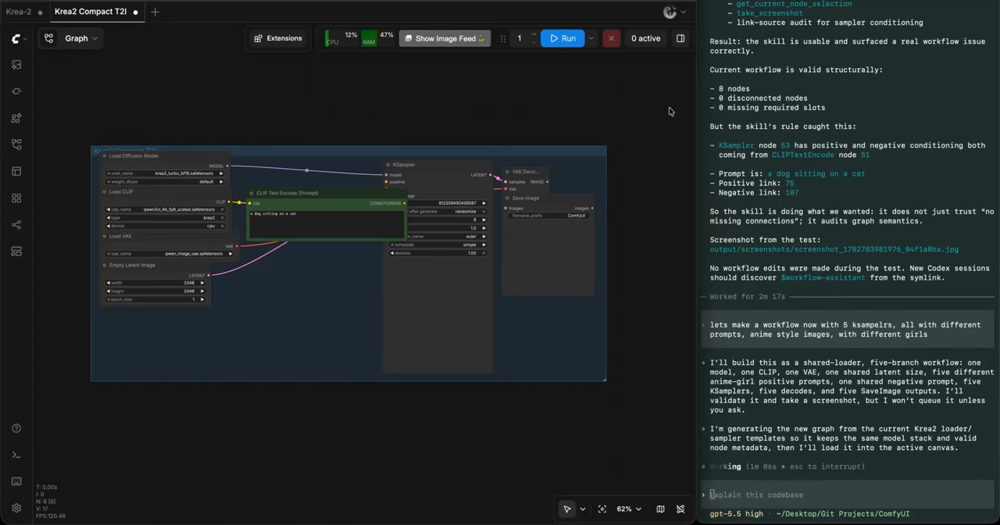
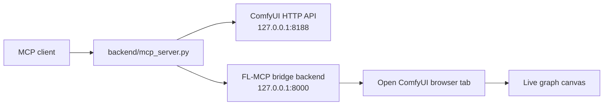

# ComfyUI FL-MCP

MCP server and browser bridge for controlling ComfyUI from MCP-compatible clients.

[](https://github.com/comfyanonymous/ComfyUI)
[](https://modelcontextprotocol.io/)
[](https://gofastmcp.com/)
[](https://www.python.org/)
[](https://www.patreon.com/Machinedelusions)

## Demo

[](assets/fl-mcp-demo.webm)

[Watch the demo video](assets/fl-mcp-demo.webm)

## What It Does

ComfyUI FL-MCP exposes ComfyUI as a tool server for MCP clients such as Claude Desktop, Cursor, Codex, and other agentic development environments.

It provides two control paths:

| Path | Works When | Best For |
|---|---|---|
| **ComfyUI REST tools** | ComfyUI is running on `127.0.0.1:8188` | Models, queue, history, Manager v4, files, diagnostics |
| **Browser bridge tools** | ComfyUI is open in a browser tab with FL-MCP connected | Current canvas JSON, node selection, layout, screenshots, frontend commands |



## Highlights

- **108 MCP tools** for workflow inspection, graph editing, queue control, Manager v4, model discovery, filesystem inspection, custom node development, and diagnostics.
- **Embedded ComfyUI bridge** with a small `FL-MCP` sidebar panel.
- **Standalone MCP mode** for REST-only control when no browser tab is open.
- **Live canvas bridge** for frontend-only actions such as reading the current graph, selecting/focusing nodes, screenshots, and layout edits.
- **Safety gates** keep destructive/write actions disabled by default.
- **Custom-node aware coding tools** scoped to `ComfyUI/custom_nodes`.

## Installation

### Manual Install

```bash
cd /path/to/ComfyUI/custom_nodes
git clone https://github.com/filliptm/ComfyUI_FL-MCP.git
cd ComfyUI_FL-MCP
pip install -r requirements.txt
```

Restart ComfyUI. The sidebar should show an `FL-MCP` bridge tab.

### Recommended `.env`

```bash
cd /path/to/ComfyUI/custom_nodes/ComfyUI_FL-MCP
cp .env.example .env
```

Default local settings:

```dotenv
AUTO_START_BACKEND=true
BACKEND_LAUNCH_MODE=subprocess
WS_HOST=127.0.0.1
WS_PORT=8000
COMFYUI_SERVER_URL=http://127.0.0.1:8188
```

## Quick Start

1. Start ComfyUI.
2. Open ComfyUI in your browser.
3. Confirm the `FL-MCP` sidebar tab reports the backend as online.
4. Configure your MCP client to run `backend/mcp_server.py`.
5. Call `mcp_capability_audit` from the MCP client to see which capabilities are available.

<details>
<summary><strong>Claude Desktop / Cursor-style MCP config</strong></summary>

Use the Python executable from the same environment where dependencies are installed.

```json
{
  "mcpServers": {
    "comfyui-fl-mcp": {
      "command": "python",
      "args": [
        "/path/to/ComfyUI/custom_nodes/ComfyUI_FL-MCP/backend/mcp_server.py"
      ],
      "env": {
        "COMFYUI_SERVER_URL": "http://127.0.0.1:8188"
      }
    }
  }
}
```

This enables REST-friendly tools. Browser-only tools return `requires_browser_bridge` unless you also connect a live bridge session.

</details>

<details>
<summary><strong>Enable live browser/canvas tools</strong></summary>

Browser-only tools need a connected ComfyUI tab. Open ComfyUI, open the `FL-MCP` sidebar panel, then run the MCP server with the session details shown by the bridge:

```bash
FL_MCP_MODE=subprocess \
FL_MCP_SESSION_ID=<session-id-from-sidebar> \
FL_MCP_WS_URL=ws://127.0.0.1:8000/ws \
python backend/mcp_server.py
```

Use this mode for tools like:

- `workflow_get_current_json`
- `workflow_load_json`
- `find_node`
- `set_node_values`
- `connect_nodes`
- `modify_layout`
- `take_screenshot`

</details>

## Operating Modes

| Mode | Process Model | How It Starts | Lifetime |
|---|---|---|---|
| **Embedded subprocess** | Separate child process | ComfyUI imports this custom node and starts `backend/server.py` | Tied to ComfyUI parent process |
| **Daemon launcher** | Separate daemon process | Sidebar start route launches `mcp_daemon.py` | Can be stopped via launcher route |
| **MCP stdio server** | MCP client subprocess | MCP client starts `backend/mcp_server.py` | Tied to the MCP client |

The bridge backend does **not** run inside ComfyUI's main event loop. It runs as a separate Python process on `127.0.0.1:8000`.

## Safety Gates

Read-only tools are available by default. Anything that writes files, edits workflows, mutates Manager state, pushes git commits, or controls processes must be explicitly enabled.

```dotenv
FL_MCP_ENABLE_WORKFLOW_WRITES=false
FL_MCP_ENABLE_CUSTOM_NODE_WRITES=false
FL_MCP_ENABLE_GIT_WRITES=false
FL_MCP_ENABLE_MANAGER_MUTATIONS=false
FL_MCP_ENABLE_COMFY_PROCESS_CONTROL=false
```

| Gate | Enables |
|---|---|
| `FL_MCP_ENABLE_WORKFLOW_WRITES` | Canvas mutation, workflow load/save/delete, settings writes, history deletes |
| `FL_MCP_ENABLE_CUSTOM_NODE_WRITES` | Writing files, applying patches, creating custom node packs |
| `FL_MCP_ENABLE_GIT_WRITES` | Git commit and push tools under custom nodes |
| `FL_MCP_ENABLE_MANAGER_MUTATIONS` | ComfyUI Manager install/update/uninstall queue actions |
| `FL_MCP_ENABLE_COMFY_PROCESS_CONTROL` | Starting, stopping, and restarting managed ComfyUI processes |

## Tool Inventory

FL-MCP currently exposes **108 tools**.

<details open>
<summary><strong>Capability and Utility Tools</strong></summary>

| Tool | What it does |
|---|---|
| `mcp_capability_audit` | Audits bridge, REST, Manager, assets, and safety-gate state |
| `calculate_expressions` | Evaluates batches of math expressions for layout or parameter planning |
| `wait` | Waits for a short period, useful after queueing work |
| `generate_seed` | Generates a random seed |
| `generate_float` | Generates a random float |
| `generate_int` | Generates a random integer |
| `random_choice` | Picks a random item from a list |
| `get_system_info` | Reports OS, Python, paths, and environment details |

</details>

<details>
<summary><strong>Live Workflow and Canvas Tools</strong></summary>

These generally require the browser bridge.

| Tool | What it does |
|---|---|
| `query_workflow` | Queries the graph with filters, traversal, and aggregation |
| `workflow_overview` | Summarizes the current workflow |
| `workflow_diagram` | Generates a Mermaid workflow diagram |
| `workflow_get_current_json` | Reads the active workflow as editable JSON or API prompt JSON |
| `workflow_load_json` | Loads workflow JSON into the active canvas |
| `workflow_get_tabs` | Lists open workflow tabs and active tab |
| `workflow_close_current` | Closes the active workflow tab |
| `workflow_duplicate_current` | Duplicates the active workflow tab |
| `find_node` | Finds a node by ID, type, or title |
| `create_nodes` | Creates one or more nodes |
| `remove_nodes` | Removes nodes |
| `bypass_nodes` | Bypasses nodes |
| `unbypass_nodes` | Unbypasses nodes |
| `pin_nodes` | Pins nodes |
| `unpin_nodes` | Unpins nodes |
| `select_nodes` | Selects nodes in the UI |
| `get_current_node_selection` | Reads the current selected nodes |
| `focus_on_nodes` | Fits the canvas view to nodes, selection, or graph |
| `take_screenshot` | Captures the current canvas |
| `get_node_values` | Reads widget values from a node |
| `set_node_values` | Sets widget values on a node |
| `get_node_slots` | Reads detailed input/output slot metadata |
| `connect_nodes` | Connects two nodes |
| `connect_nodes_batch` | Connects multiple node pairs |
| `auto_connect_workflow` | Auto-connects nodes based on type compatibility |
| `get_layout` | Reads node positions and sizes |
| `modify_layout` | Applies manual layout or auto-layout |

</details>

<details>
<summary><strong>Workflow Files and Tabs</strong></summary>

| Tool | What it does |
|---|---|
| `workflow_list_files` | Lists saved workflow files from ComfyUI user data |
| `workflow_read_file` | Reads saved workflow JSON |
| `workflow_save_current` | Saves the current workflow |
| `workflow_rename_file` | Renames or moves a workflow file |
| `workflow_delete_file` | Deletes a workflow file |

</details>

<details>
<summary><strong>Frontend Command Tools</strong></summary>

| Tool | What it does |
|---|---|
| `frontend_list_commands` | Lists registered ComfyUI frontend commands |
| `frontend_execute_command` | Executes a frontend command by ID |
| `frontend_list_keybindings` | Lists frontend commands and keybindings |

</details>

<details>
<summary><strong>Queue, Jobs, History, and Execution Tools</strong></summary>

| Tool | What it does |
|---|---|
| `queue_workflow` | Queues the current workflow |
| `cancel_workflow` | Cancels current execution |
| `enable_auto_queue` | Enables auto-queue |
| `disable_auto_queue` | Disables auto-queue |
| `set_batch_count` | Sets workflow batch count |
| `get_queue_status` | Reads frontend queue status |
| `get_queue_status_details` | Reads detailed ComfyUI queue and active execution state |
| `delete_queue_items` | Deletes items from the ComfyUI execution queue |
| `comfy_jobs_list` | Lists native ComfyUI jobs |
| `comfy_job_get` | Reads a job by prompt/job ID |
| `get_execution_history` | Reads queue and history from ComfyUI |
| `get_execution_details` | Reads detailed execution state for one run |
| `clear_error_buffer` | Clears the bridge error buffer |
| `comfy_history_delete` | Deletes history entries or clears history |

</details>

<details>
<summary><strong>ComfyUI REST, Models, Assets, and Files</strong></summary>

| Tool | What it does |
|---|---|
| `comfy_status` | Checks ComfyUI process and HTTP reachability |
| `comfy_get_logs` | Reads recent managed ComfyUI logs |
| `comfy_free_memory` | Unloads models and/or frees memory |
| `comfy_settings_get` | Reads ComfyUI settings |
| `comfy_settings_set` | Writes ComfyUI settings |
| `comfy_upload_image` | Uploads an image from inside the ComfyUI tree |
| `comfy_upload_mask` | Uploads a mask from inside the ComfyUI tree |
| `comfy_models_list` | Lists model folders or files |
| `comfy_workflow_templates_list` | Lists or reads workflow templates |
| `comfy_global_subgraphs_list` | Lists or reads global subgraphs |
| `comfy_node_replacements_get` | Reads node replacement mappings |
| `comfy_assets_list` | Lists assets when the assets feature is enabled |
| `comfy_asset_get` | Reads one asset metadata record |
| `comfy_asset_upload` | Uploads a ComfyUI-root file to assets |
| `comfy_assets_upload` | Alias for asset upload |
| `comfy_tags_list` | Lists asset tags |
| `comfy_list_folders` | Lists ComfyUI folders with filtering and sorting |
| `comfy_read_file` | Reads files inside approved ComfyUI folders |
| `comfy_search_resources` | Searches ComfyUI files |
| `extract_workflow_from_image` | Extracts workflow metadata from PNG/WebP images |
| `comfy_restart` | Restarts a managed ComfyUI process |

</details>

<details>
<summary><strong>Node Library and Compatibility Tools</strong></summary>

| Tool | What it does |
|---|---|
| `node_library_search` | Searches available ComfyUI node types |
| `node_library_get_details` | Reads detailed metadata for a node type |
| `node_library_find_compatible` | Finds compatible node types for connections |

</details>

<details>
<summary><strong>ComfyUI Manager Tools</strong></summary>

| Tool | What it does |
|---|---|
| `manager_v4_status` | Reports Manager v4 availability and queue status |
| `manager_v4_queue_status` | Reads Manager v4 queue status |
| `manager_v4_queue_action` | Queues a confirmation-gated Manager v4 action |
| `manager_v4_installed_packs` | Lists installed custom node packs |
| `manager_v4_snapshots` | Lists Manager snapshots |
| `manager_v4_node_mappings` | Finds node-to-pack mappings |
| `manager_v4_external_models` | Searches external model definitions |
| `manager_queue_action` | Queues install/update/uninstall/disable actions |
| `manager_queue_status` | Reads Manager queue status |
| `manager_queue_start` | Starts the Manager worker queue |
| `manager_queue_reset` | Resets the Manager queue |
| `manager_search_nodes` | Searches Manager custom node packs |
| `manager_get_node_mappings` | Finds which pack provides a node type |
| `manager_check_updates` | Checks installed packs for updates |
| `manager_search_external_models` | Searches Manager external models |

</details>

<details>
<summary><strong>Custom Node Development Tools</strong></summary>

All paths are scoped under `ComfyUI/custom_nodes`.

| Tool | What it does |
|---|---|
| `custom_nodes_list_packs` | Lists installed custom node packs |
| `custom_nodes_read_file` | Reads a bounded line range from a custom node file |
| `custom_nodes_read_file_excerpt` | Reads a bounded excerpt from a large file |
| `custom_nodes_search` | Searches custom node code with ripgrep |
| `custom_nodes_write_file` | Writes a full file |
| `custom_nodes_apply_patch` | Applies a unified diff |
| `custom_nodes_create_pack` | Creates a starter custom node pack |
| `custom_nodes_validate_pack` | Runs Python compile validation |
| `custom_nodes_git_status` | Shows git status for a custom node repo |
| `custom_nodes_git_diff` | Shows git diff |
| `custom_nodes_git_commit` | Commits changes |
| `custom_nodes_git_push` | Pushes changes |

</details>

## API Endpoints

When the bridge backend is running on `127.0.0.1:8000`:

| Endpoint | Purpose |
|---|---|
| `GET /health` | Health and active sessions |
| `GET /api/config` | Browser client config |
| `GET /api/mcp/status` | MCP bridge status |
| `POST /api/mcp/shutdown` | Stop daemon mode backend |
| `GET /api/sessions` | Connected browser/MCP WebSocket sessions |
| `WS /ws` | Browser/MCP bridge WebSocket |
| `GET /api/comfy/status` | Managed ComfyUI process status |
| `GET /api/comfy/logs` | Managed ComfyUI logs |

ComfyUI also receives custom-node launcher routes:

| Route | Purpose |
|---|---|
| `GET /fl_mcp/launcher/status` | Backend launcher status |
| `POST /fl_mcp/launcher/start` | Start daemon backend |
| `POST /fl_mcp/launcher/stop` | Stop daemon backend |

## Common Workflows

<details>
<summary><strong>Ask what workflow is open</strong></summary>

1. Open ComfyUI in a browser.
2. Confirm the FL-MCP panel is connected.
3. Ask your MCP client to call `workflow_get_current_json` or `workflow_overview`.

</details>

<details>
<summary><strong>Clean up or compact a graph layout</strong></summary>

Useful tools:

- `get_layout`
- `modify_layout`
- `focus_on_nodes`
- `workflow_get_current_json`
- `workflow_load_json`

</details>

<details>
<summary><strong>Inspect custom nodes before editing</strong></summary>

Useful tools:

- `custom_nodes_list_packs`
- `custom_nodes_search`
- `custom_nodes_read_file_excerpt`
- `custom_nodes_git_diff`
- `custom_nodes_validate_pack`

Enable `FL_MCP_ENABLE_CUSTOM_NODE_WRITES=true` only when you want the MCP client to write files or apply patches.

</details>

## Troubleshooting

<details>
<summary><strong>Browser-only tools say <code>requires_browser_bridge</code></strong></summary>

Open ComfyUI in a browser and make sure the `FL-MCP` sidebar panel is connected. REST tools can run without this, but live graph tools need the frontend bridge.

</details>

<details>
<summary><strong>Backend did not start</strong></summary>

Check:

```bash
curl http://127.0.0.1:8188/fl_mcp/launcher/status
curl http://127.0.0.1:8000/health
```

Logs are written under:

```text
ComfyUI/custom_nodes/ComfyUI_FL-MCP/backend/logs/
ComfyUI/custom_nodes/ComfyUI_FL-MCP/logs/
```

</details>

<details>
<summary><strong>A write tool is disabled</strong></summary>

This is expected. Turn on the narrowest matching safety gate in `.env`, restart the backend, run the action, then turn it off again.

</details>

## Optional Agent Skill

This repo includes an optional Codex-style skill at:

```text
skills/workflow-assistant/
```

The skill gives MCP clients workflow-first guidance for inspecting, editing, debugging, compacting, validating, and queueing ComfyUI graphs through FL-MCP. It is optional and does not change the FL-MCP server runtime.

Install it by copying or symlinking the skill folder into your client skills directory. For Codex:

```bash
mkdir -p ~/.codex/skills
ln -s /path/to/ComfyUI/custom_nodes/ComfyUI_FL-MCP/skills/workflow-assistant \
  ~/.codex/skills/workflow-assistant
```

Then start a new client session and invoke it explicitly when useful:

```text
Use $workflow-assistant to inspect and clean up my open ComfyUI workflow.
```

You still need to configure the `comfyui-fl-mcp` MCP server separately as described in Quick Start.

## Development

```bash
cd /path/to/ComfyUI/custom_nodes/ComfyUI_FL-MCP
pip install -r requirements.txt
pytest
```

Useful local checks:

```bash
python -m py_compile __init__.py mcp_daemon.py backend/server.py backend/mcp_server.py
for f in web/js/*.js; do node --check "$f"; done
```

## Support

If this saves you time building ComfyUI workflows or custom nodes, support ongoing FL custom node development:

[](https://www.patreon.com/Machinedelusions)
