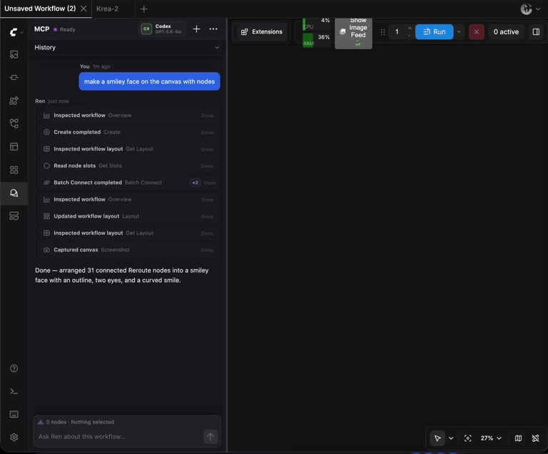
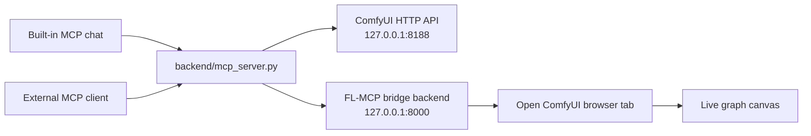

# ComfyUI FL-MCP

Built-in MCP chat, tool server, and browser bridge for controlling ComfyUI.

[](https://github.com/comfyanonymous/ComfyUI)
[](https://www.patreon.com/Machinedelusions)

## Demo




## What It Does

ComfyUI FL-MCP adds an MCP-native workflow chat to ComfyUI and exposes the same tools to external clients such as Claude Desktop, Cursor, Codex, and other agentic development environments. The built-in assistant is powered by Ren and appears directly in the ComfyUI sidebar.

It provides three control paths:

| Path | Works When | Best For |
|---|---|---|
| **MCP chat (built in)** | ComfyUI is open with the bridge backend running | Chatting with, inspecting, and editing the current graph without leaving ComfyUI |
| **ComfyUI REST tools** | ComfyUI is running on `127.0.0.1:8188` | Models, queue, history, Manager v4, files, diagnostics |
| **Browser bridge tools** | ComfyUI is open in a browser tab with FL-MCP connected | Current canvas JSON, node selection, layout, screenshots, frontend commands |


```mermaid
flowchart LR
    A[Built-in MCP chat] --> B[backend/mcp_server.py]
    G[External MCP client] --> B
    B --> C[ComfyUI HTTP API<br/>127.0.0.1:8188]
    B --> D[FL-MCP bridge backend<br/>127.0.0.1:8000]
    D --> E[Open ComfyUI browser tab]
    E --> F[Live graph canvas]
```

## Highlights

- **135 MCP tools** for workflow inspection, graph editing, queue control, Manager v4, model discovery, filesystem inspection, custom node development, and diagnostics.
- **Built-in MCP chat**, powered by Ren, with streaming responses, persistent conversation history, chronological tool activity, and approval cards.
- **Bring your own model** through LM Studio, Ollama, OpenAI, OpenRouter, Anthropic, Claude Code, Codex, or a custom OpenAI-compatible endpoint.
- **Use existing subscriptions** from Claude Code or Codex without copying OAuth credentials into FL-MCP.
- **Canvas-aware editing** keeps generated nodes from overlapping and makes ComfyUI's Fit View respect the open chat panel.
- **Embedded ComfyUI bridge diagnostics** remain available from the assistant sidebar.
- **Standalone MCP mode** for REST-only control when no browser tab is open.
- **Live canvas bridge** for frontend-only actions such as reading the current graph, selecting/focusing nodes, screenshots, and layout edits.
- **Safety gates** keep destructive/write actions disabled by default.
- **Custom-node aware coding tools** scoped to `ComfyUI/custom_nodes`.

## Installation

### Manual Install

```bash
cd /path/to/ComfyUI/custom_nodes
git clone https://github.com/filliptm/ComfyUI_FL-MCP.git
cd ComfyUI_FL-MCP
pip install -r requirements.txt
```

Restart ComfyUI. The sidebar should show a `Ren` tab with a chat-bubble icon. Inside that tab, the main panel is labeled **MCP**.

### ComfyUI Desktop

Desktop installations can contain more than one Python environment. Install
FL-MCP requirements with the interpreter used by the running ComfyUI app, not
an unqualified `pip`. From the ComfyUI directory on macOS or Linux:

```bash
./.venv/bin/python -m pip install -r custom_nodes/ComfyUI_FL-MCP/requirements.txt
```

On Windows:

```powershell
.\.venv\Scripts\python.exe -m pip install -r .\custom_nodes\ComfyUI_FL-MCP\requirements.txt
```

Restart ComfyUI after installation. If the backend cannot start, **Ren →
Settings → Bridge diagnostics** displays the launcher failure and log path.

### Bridge settings

The local defaults work for a standard ComfyUI install. To change the backend
launch mode, bind address, ports, ComfyUI path, extra model paths file, logging,
generation waiting behavior, or server-side safety gates, open **Ren → Settings
→ Bridge & safety**.

Bridge settings are validated and stored locally in
`.fl_mcp/bridge_settings.json`. Changes take effect after restarting ComfyUI.
If an older install has a `.env` file, supported values are imported once when
the JSON settings file does not yet exist. The legacy file is left untouched
and is no longer read after that import.

## Quick Start

1. Start ComfyUI.
2. Open ComfyUI in your browser.
3. Open the `Ren` sidebar tab.
4. Select the provider badge in the top bar, or open **More options → Settings**.
5. Select a provider, discover or choose a model, then choose **Save and test**.
6. Ask about the open workflow. Tool calls remain in chronological order alongside the response that produced them.

### Model providers

| Provider | Authentication | Model selection |
|---|---|---|
| **LM Studio** | Local endpoint; no API key | Discovers loaded or available models |
| **Ollama** | Local endpoint; no API key | Discovers installed models |
| **OpenAI API** | OpenAI API key | Editable API model field |
| **OpenRouter API** | OpenRouter API key | Editable API model field |
| **Anthropic API** | Anthropic API key | Editable API model field |
| **Claude subscription** | Existing Claude Code login | Dropdown of supported Claude Code models and aliases |
| **Codex subscription** | Existing Codex login | Dropdown populated from the installed Codex CLI |
| **Custom endpoint** | Optional API key | Editable OpenAI-compatible model field |

API credentials are stored in the operating-system keychain when available. Claude and Codex subscription modes remain separate from direct Anthropic and OpenAI API access and billing.

To use a Claude Pro, Max, Team, or Enterprise subscription, install Claude Code and sign in once:

```bash
claude auth login
```

Then choose **Claude subscription** under **Settings → Connection**. FL-MCP checks the official Claude Code login, does not read or copy its OAuth credentials, and keeps direct Anthropic API-key access as a separate provider.

To use a ChatGPT Plus, Pro, Business, Edu, or Enterprise subscription with Codex, install the Codex CLI and sign in once:

```bash
codex login
```

Then choose **Codex subscription** under **Settings → Connection**. FL-MCP uses the official Codex SDK and its existing ChatGPT login without reading or copying OAuth credentials. Direct OpenAI API-key access remains a separate provider and billing path.

Routine canvas edits can run without an extra prompt. Queueing, workflow deletion, package changes, file writes, Git operations, and process restarts display an approval card before the tool runs by default. Choose **Always allow** on a card to remember that MCP tool, or enable **Bypass all approval prompts** under **Settings → Permissions** to skip every chat approval. The server-side safety gates described below still apply in either mode.

### Using the built-in chat

- The fixed top bar shows **MCP**, connection status, and the active provider and model.
- Each open workflow tab has its own selected conversation and unsent draft. Switching tabs restores that workflow's chat and stops any response that was still running in the previous tab.
- Select **History** to search, rename, archive, restore, or permanently delete conversations.
- History remains global: use **Switch workflow** for a conversation whose workflow is open, or attach an older unassigned conversation to the active workflow.
- Tool calls stay at their chronological position in the conversation. Consecutive identical calls collapse into a single row with an `×N` count while retaining each call's details.
- Approval cards support **Deny**, **Allow once**, and persistent per-tool **Always allow** decisions. Saved rules can be cleared from **Settings → Permissions**.
- **Bypass all approval prompts** disables the chat approval layer globally. It does not override the server-side workflow, file, Git, Manager, or process safety gates.
- **Wait for generation completion by default** keeps a single `queue_workflow` tool call open while ComfyUI runs, avoiding repeated model-driven status requests. Each call can override the saved behavior and timeout.
- The composer remains fixed below the scrollable conversation. **Jump to present** scrolls smoothly when new activity arrives out of view.
- ComfyUI's native Fit View accounts for the visible canvas beside the open chat panel.
- Automatic node insertion uses real node bounds and graph extents to avoid stacking new nodes on top of existing nodes.

### Deterministic workflow building

Ren uses the same two-step graph compiler for a new workflow, a small edit, or a
multi-branch refinement:

1. `compile_workflow_refinement_spec` resolves the request against the active
   native, partner, and custom-node catalog, the current canvas (which may be
   empty), exact node schemas, dynamic inputs, attachments, stable defaults,
   and active exact-schema verified connection lessons.
2. `apply_workflow_graph_patch` refreshes and recompiles that canonical plan,
   then applies it as one guarded transaction without queueing the workflow.

The root GraphPatch v2 plan describes edges directly, so it can create fan-in,
fan-out, merges, multiple terminal outputs, retained-node updates, removals,
and widget-to-input connections such as wiring a video's FPS into Video
Combine. Before changing the canvas it checks workflow, graph, catalog, schema,
slot, value, attachment, and cycle preconditions. Afterward it verifies the
exact final graph while preserving unrelated workflow state. Any mismatch
restores the complete original snapshot. Ambiguous node selection is returned
to the user as a choice instead of being resolved alphabetically.

Scoped GraphPatch v3 applies the same transaction, verification, rollback, and
idempotency guarantees inside one exact subgraph definition while retaining the
full root workflow as the mutation authority. Public subgraph input/output
boundaries are schema-attested ports; compiler-only virtual nodes never appear
on the apply wire.

The compiler resolves semantic endpoint intent to exact dynamic paths and
prefers direct connections. If source and target types are incompatible, it may
search a bounded capability hypergraph for a unique supported local converter.
This is schema-driven for every loaded class rather than hardcoded to named
nodes. Equal routes require a user choice; partner/API/heavy/output nodes are
never inferred without explicit intent, and exact/no-extra requests disable
inference entirely.

### Branch navigation and scoped editing

Ren can discover workflow splits, reconvergences, terminal arms, and maximal
non-branching segments without enumerating every source-to-sink path. Each
region receives an exact `branch_id` for mutation authority and an ID-independent
structural fingerprint for comparison. IDs are typed, scope-aware, and pinned to
the active workflow and graph before any navigation or edit.

Natural requests such as “jump to the upscale branch,” “compare the preview and
final branches,” or “replace this whole branch” use the branch tools first.
Ambiguous matches return bounded candidates and perform no selection. Exact
navigation selects and fits every branch node as one locked UI action. Root and
authorized nested clone, replace, and remove requests compile back into the same
atomic GraphPatch writer, including the complete incident-edge boundary, so
sibling nodes, connections, values, rectangles, groups, reroutes, definitions,
and workflow fields remain unchanged.

After a successful branch mutation,
`resolve_workflow_branch_successor` re-attests the persisted GraphPatch result,
rediscovers every affected scope, and returns exact predecessor-to-successor
lineage. It returns a singular successor only when exactly one exists; clones or
replacement DAGs may correctly return several, while a verified removal returns
an empty successor list. No lineage result is guessed from a label or stale
fingerprint.

Clone is deliberately bounded to private branch regions whose widgets and
boundaries can be reconstructed exactly. External sources are shared. For a
non-terminal or reconvergent branch, the copied region's external outputs stay
detached and the result reports their exact edge IDs; the merge target and every
sibling remain untouched. Upload/attachment or credential-bearing inputs,
unreproducible execution state, and unacknowledged risky partner/output work fail
closed rather than being copied implicitly.

Nested branches use recursive `{container_node_id, subgraph_id}` scope paths.
Unique definitions can be edited in place. Reused definitions require an
explicit shared-definition acknowledgement listing every affected instance;
instance-only copy-on-write detachment is rejected until that separate operation
is supported. Virtual subgraph inputs and outputs are schema-attested boundary
ports rather than ordinary editable nodes. Branch tools never run or queue the
workflow.

Node creation and connections remain visibly sequential on the canvas. Small
graphs retain the deliberate step-by-step feel, while larger patches use a
bounded animation budget so visual pacing does not make complex builds slow.

### External MCP clients

To use FL-MCP from another client:

1. Open **More options → Bridge diagnostics** and confirm the backend and browser bridge are connected.
2. Configure the MCP client to run `backend/mcp_server.py`.
3. Call `mcp_capability_audit` to see which capabilities are available.

<details>
<summary><strong>Claude Desktop / Cursor-style MCP config</strong></summary>

Use the Python executable from the same environment where dependencies are installed.

```json
{
  "mcpServers": {
    "comfyui-fl-mcp": {
      "command": "python",
      "args": [
        "/path/to/ComfyUI/custom_nodes/ComfyUI_FL-MCP/backend/mcp_server.py"
      ]
    }
  }
}
```

This enables REST-friendly tools. Browser-only tools return `requires_browser_bridge` unless you also connect a live bridge session.

</details>

<details>
<summary><strong>Enable live browser/canvas tools</strong></summary>

Browser-only tools need a connected ComfyUI tab. Open ComfyUI, open the `Ren` sidebar panel, then use **Bridge diagnostics** to confirm the live connection before running the MCP server:

```bash
FL_MCP_MODE=subprocess \
FL_MCP_SESSION_ID=<session-id-from-sidebar> \
FL_MCP_WS_URL=ws://127.0.0.1:8000/ws \
python backend/mcp_server.py
```

Use this mode for tools like:

- `workflow_get_current_json`
- `workflow_load_json`
- `find_node`
- `set_node_values`
- `connect_nodes`
- `modify_layout`
- `take_screenshot`

</details>

## Operating Modes

| Mode | Process Model | How It Starts | Lifetime |
|---|---|---|---|
| **Embedded subprocess** | Separate child process | ComfyUI imports this custom node and starts `backend/server.py` | Tied to ComfyUI parent process |
| **Daemon launcher** | Separate daemon process | Sidebar start route launches `mcp_daemon.py` | Can be stopped via launcher route |
| **MCP stdio server** | MCP client subprocess | MCP client starts `backend/mcp_server.py` | Tied to the MCP client |

The bridge backend does **not** run inside ComfyUI's main event loop. It runs as a separate Python process and prefers `127.0.0.1:8000`. If that port belongs to another service, the embedded launcher selects an available fallback port and reports the actual URL through **Bridge diagnostics** and `/fl_mcp/launcher/status`.

## Assistant Data and Security

- Non-secret assistant settings, approval mode, and per-tool **Always allow** rules are stored under `.fl_mcp/chat_settings.json`.
- Non-secret bridge, path, logging, and safety settings are stored under `.fl_mcp/bridge_settings.json`.
- Conversations, messages, run state, approvals, and tool activity are stored locally in `.fl_mcp/chat.db`.
- Existing conversations from `.ren/ren.db` are imported once when that database is present. Legacy provider secrets and session metadata are not copied.
- API credentials use the OS keychain when available, then environment variables, with an in-memory fallback if the keychain cannot be used.
- Claude subscription mode delegates authentication and credential storage to the installed Claude Code CLI. FL-MCP stores only the Claude session ID needed to resume each MCP chat conversation.
- Codex subscription mode delegates authentication and credential storage to Codex. FL-MCP stores only the Codex thread ID needed to resume each MCP chat conversation.
- Assistant output is rendered with a small local Markdown renderer. It does not load a CDN renderer or insert model text as raw HTML.
- The assistant starts a separate MCP stdio process for each active run. Multiple embedded or external MCP clients can share one browser session without receiving each other's tool results.

## Safety Gates

Read-only tools and workflow-editing tools are available by default so Ren can
prepare and execute ordinary ComfyUI workflows. Workflow writes can still be
disabled explicitly. Writing custom-node files, mutating Manager state, pushing
git commits, and controlling processes must be explicitly enabled.

Open **Ren → Settings → Bridge & safety → Server-side capabilities** to change
these gates, save, and restart ComfyUI.

| Gate | Enables |
|---|---|
| **Workflow writes** *(on by default)* | Canvas mutation, workflow load/save/delete, settings writes, history deletes |
| **Custom node writes** | Writing files, applying patches, creating custom node packs |
| **Git writes** | Git commit and push tools under custom nodes |
| **Manager mutations** | ComfyUI Manager install/update/uninstall queue actions |
| **Process control** | Starting, stopping, and restarting managed ComfyUI processes |

## Tool Inventory

FL-MCP currently exposes **135 tools**.

<details open>
<summary><strong>Capability and Utility Tools</strong></summary>

| Tool | What it does |
|---|---|
| `mcp_capability_audit` | Audits bridge, REST, Manager, assets, and safety-gate state |
| `calculate_expressions` | Evaluates batches of math expressions for layout or parameter planning |
| `wait` | Waits for a short period, useful after queueing work |
| `generate_seed` | Generates a random seed |
| `generate_float` | Generates a random float |
| `generate_int` | Generates a random integer |
| `random_choice` | Picks a random item from a list |
| `get_system_info` | Reports OS, Python, paths, and environment details |

</details>

<details>
<summary><strong>Live Workflow and Canvas Tools</strong></summary>

These generally require the browser bridge.

| Tool | What it does |
|---|---|
| `query_workflow` | Queries the graph with filters, traversal, and aggregation |
| `workflow_overview` | Summarizes the current workflow |
| `workflow_diagram` | Generates a Mermaid workflow diagram |
| `workflow_get_current_json` | Reads the active workflow as editable JSON or API prompt JSON |
| `workflow_load_json` | Loads workflow JSON into the active canvas |
| `workflow_get_tabs` | Lists open workflow tabs and active tab |
| `workflow_close_current` | Closes the active workflow tab |
| `workflow_duplicate_current` | Duplicates the active workflow tab |
| `find_node` | Finds a node by ID, type, or title |
| `create_nodes` | Creates one or more nodes |
| `compile_workflow_refinement_spec` | Compiles a semantic new build or existing-workflow edit into one exact catalog-, schema-, graph-, and workflow-pinned root GraphPatch v2 |
| `apply_workflow_graph_patch` | Atomically applies a root GraphPatch v2 or scoped GraphPatch v3 with deterministic visible pacing, exact verification, idempotency, full-root rollback, and no queue action |
| `workflow_branches_discover` | Discovers deterministic root or nested branch regions, exact boundaries, stable IDs, relationships, and bounded ambiguity diagnostics |
| `workflow_branch_compare` | Compares two exact branches read-only using topology, node classes, schema facts, and credential-safe value/dynamic digests |
| `workflow_branch_navigate` | Atomically selects and focuses one exact workflow-, graph-, catalog-, and scope-pinned branch |
| `compile_workflow_branch_operation` | Compiles an exact root or nested branch clone, replacement, or removal into GraphPatch v2/v3 without mutating or queueing; reused definitions require explicit all-instance acknowledgement |
| `resolve_workflow_branch_successor` | Re-attests a completed branch GraphPatch and returns exact per-scope predecessor-to-successor branch IDs without mutating or queueing |
| `apply_workflow_plan` | Atomically creates and connects a validated catalog-pinned plan with idempotency, verification, and rollback |
| `plan_workflow_refinement` | Validates exact linear edits or a terminal append with retained-source side-input fan-in against the current graph and live node schemas |
| `apply_workflow_refinement` | Atomically applies a graph refinement while preserving unrelated nodes, edges, and source fan-out, with full-snapshot rollback and no queue action |
| `remove_nodes` | Removes nodes |
| `bypass_nodes` | Bypasses nodes |
| `unbypass_nodes` | Unbypasses nodes |
| `pin_nodes` | Pins nodes |
| `unpin_nodes` | Unpins nodes |
| `select_nodes` | Selects nodes in the UI |
| `get_current_node_selection` | Reads the current selected nodes |
| `focus_on_nodes` | Fits the canvas view to nodes, selection, or graph |
| `take_screenshot` | Captures the current canvas |
| `get_node_values` | Reads widget values from a node |
| `set_node_values` | Sets widget values on a node |
| `view_prompt_reference_image` | Resolves and displays the exact image producer connected to an `image2`/reference input without treating the role label as a node ID |
| `update_connected_prompt` | Resolves and exactly replaces, appends, prepends, or removes literal text in one connected STRING prompt producer with workflow/graph attestation and no graph planner |
| `get_node_slots` | Reads detailed input/output slot metadata |
| `connect_nodes` | Connects two nodes |
| `connect_nodes_batch` | Connects multiple node pairs |
| `auto_connect_workflow` | Auto-connects nodes based on type compatibility |
| `get_layout` | Reads node positions and sizes |
| `modify_layout` | Applies manual layout or auto-layout |

</details>

New clients should use `compile_workflow_refinement_spec` followed by the returned
unchanged `apply_workflow_graph_patch` request for both new builds and edits. The
older plan/apply workflow and linear-refinement tools remain compatibility APIs.

<details>
<summary><strong>Workflow Files and Tabs</strong></summary>

| Tool | What it does |
|---|---|
| `workflow_list_files` | Lists saved workflow files from ComfyUI user data |
| `workflow_read_file` | Reads saved workflow JSON |
| `workflow_save_current` | Saves the current workflow |
| `workflow_rename_file` | Renames or moves a workflow file |
| `workflow_delete_file` | Deletes a workflow file |

</details>

<details>
<summary><strong>Frontend Command Tools</strong></summary>

| Tool | What it does |
|---|---|
| `frontend_list_commands` | Lists registered ComfyUI frontend commands |
| `frontend_execute_command` | Executes a frontend command by ID |
| `frontend_list_keybindings` | Lists frontend commands and keybindings |

</details>

<details>
<summary><strong>Queue, Jobs, History, and Execution Tools</strong></summary>

| Tool | What it does |
|---|---|
| `queue_workflow` | Queues the current workflow and optionally waits for a terminal result |
| `cancel_workflow` | Cancels current execution |
| `enable_auto_queue` | Enables auto-queue |
| `disable_auto_queue` | Disables auto-queue |
| `set_batch_count` | Sets workflow batch count |
| `get_queue_status` | Reads frontend queue status |
| `get_queue_status_details` | Reads detailed ComfyUI queue and active execution state |
| `delete_queue_items` | Deletes items from the ComfyUI execution queue |
| `comfy_jobs_list` | Lists native ComfyUI jobs |
| `comfy_job_get` | Reads a job by prompt/job ID |
| `get_execution_history` | Reads queue and history from ComfyUI |
| `get_execution_details` | Reads detailed execution state for one run |
| `clear_error_buffer` | Clears the bridge error buffer |
| `comfy_history_delete` | Deletes history entries or clears history |

</details>

<details>
<summary><strong>ComfyUI REST, Models, Assets, and Files</strong></summary>

| Tool | What it does |
|---|---|
| `comfy_status` | Checks ComfyUI process and HTTP reachability |
| `comfy_get_logs` | Reads recent managed ComfyUI logs |
| `comfy_free_memory` | Unloads models and/or frees memory |
| `comfy_settings_get` | Reads ComfyUI settings |
| `comfy_settings_set` | Writes ComfyUI settings |
| `comfy_upload_image` | Uploads an image from inside the ComfyUI tree |
| `comfy_upload_mask` | Uploads a mask from inside the ComfyUI tree |
| `comfy_models_list` | Lists model folders or files |
| `comfy_workflow_templates_list` | Lists or reads workflow templates |
| `comfy_global_subgraphs_list` | Lists or reads global subgraphs |
| `comfy_node_replacements_get` | Reads node replacement mappings |
| `comfy_assets_list` | Lists assets when the assets feature is enabled |
| `comfy_asset_get` | Reads one asset metadata record |
| `comfy_asset_upload` | Uploads a ComfyUI-root file to assets |
| `comfy_assets_upload` | Alias for asset upload |
| `comfy_tags_list` | Lists asset tags |
| `comfy_list_folders` | Lists ComfyUI folders with filtering and sorting |
| `comfy_read_file` | Reads files inside approved ComfyUI folders |
| `comfy_search_resources` | Searches ComfyUI files |
| `extract_workflow_from_image` | Extracts workflow metadata from PNG/WebP images |
| `comfy_restart` | Restarts a managed ComfyUI process |

</details>

<details>
<summary><strong>Node Library and Compatibility Tools</strong></summary>

Ren keeps a lightweight SQLite index of the last valid local `/object_info`
catalog. It reconciles native, partner, and custom node schemas at bridge startup
and after live catalog refreshes, marks removed classes inactive, and retains only
schema-scoped connection lessons verified by atomic canvas application. The live
catalog remains the sole authority for planning and applying workflows; persisted
or stale records are discovery aids and can never authorize a build.

| Tool | What it does |
|---|---|
| `node_library_status` | Reports or refreshes the local `/object_info` catalog identity, origin counts, and persistent-knowledge status |
| `node_library_search` | Searches node types currently loaded by this ComfyUI instance |
| `node_knowledge_search` | Searches the last-valid local index with exact origin/schema identity while labeling it discovery-only |
| `node_library_get_details` | Reads detailed metadata for a node type |
| `node_library_find_compatible` | Finds compatible node types for connections |
| `compile_workflow_refinement_spec` | Resolves a semantic build or refinement against the active canvas and all locally loaded native, partner, and custom nodes, then returns one ready-to-apply GraphPatch v2 |
| `apply_workflow_graph_patch` | Recompiles and atomically applies the exact root-v2 or scoped-v3 arbitrary-DAG patch without queueing, preserving unrelated graph and workflow state |
| `compile_workflow_spec` *(legacy compatibility)* | Resolves a complete semantic request, canonicalizes dynamic inputs, binds trusted chat images, fills stable defaults, and returns one ready-to-apply valid plan |
| `resolve_workflow_spec` | Deterministically resolves semantic roles to exact locally loaded classes with catalog pinning and origin guardrails |
| `plan_workflow` *(legacy compatibility)* | Dry-runs a catalog-pinned workflow plan and validates exact node schemas, values, and connections |
| `apply_workflow_plan` *(legacy compatibility)* | Recompiles and atomically applies an exact valid plan without queueing |
| `plan_workflow_refinement` *(legacy compatibility)* | Plans a catalog- and graph-pinned linear edit or terminal append, including exact retained-source side inputs |
| `apply_workflow_refinement` *(legacy compatibility)* | Applies the exact refinement transactionally with unrelated-graph preservation, rollback on failure, and no queue action |
| `registry_search_packages` | Searches all published packages in the official Comfy Registry and returns Registry + GitHub links |
| `registry_get_package` | Inspects one official Registry package, its published nodes, and its Registry + GitHub links |

</details>

<details>
<summary><strong>ComfyUI Manager Tools</strong></summary>

| Tool | What it does |
|---|---|
| `manager_v4_status` | Compatibility alias that reports detected Manager protocol and queue status |
| `manager_v4_queue_status` | Compatibility alias for Manager queue status |
| `manager_v4_queue_action` | Compatibility alias for confirmation-gated Manager actions |
| `manager_v4_installed_packs` | Lists installed custom node packs |
| `manager_v4_snapshots` | Lists Manager snapshots |
| `manager_v4_node_mappings` | Finds node-to-pack mappings |
| `manager_v4_external_models` | Searches external model definitions |
| `manager_queue_action` | Queues version-aware install/update/uninstall/disable actions; Manager installs dependencies in ComfyUI's Python environment |
| `manager_queue_status` | Reads Manager queue status |
| `manager_queue_start` | Starts the Manager worker queue |
| `manager_queue_reset` | Resets the Manager queue |
| `manager_search_nodes` | Searches Manager custom node packs |
| `manager_get_node_mappings` | Finds which pack provides a node type |
| `manager_check_updates` | Checks installed packs for updates |
| `manager_search_external_models` | Searches Manager external models |

</details>

<details>
<summary><strong>Custom Node Development Tools</strong></summary>

All paths are scoped under `ComfyUI/custom_nodes`.

| Tool | What it does |
|---|---|
| `custom_nodes_list_packs` | Lists installed custom node packs |
| `custom_nodes_read_file` | Reads a bounded line range from a custom node file |
| `custom_nodes_read_file_excerpt` | Reads a bounded excerpt from a large file |
| `custom_nodes_search` | Searches custom node code with ripgrep |
| `custom_nodes_write_file` | Writes a full file |
| `custom_nodes_apply_patch` | Applies a unified diff |
| `custom_nodes_create_pack` | Creates a starter custom node pack |
| `custom_nodes_validate_pack` | Runs Python compile validation |
| `custom_nodes_git_status` | Shows git status for a custom node repo |
| `custom_nodes_git_diff` | Shows git diff |
| `custom_nodes_git_commit` | Commits changes |
| `custom_nodes_git_push` | Pushes changes |

</details>

## API Endpoints

The bridge backend prefers `127.0.0.1:8000`; use **Bridge diagnostics** or `/fl_mcp/launcher/status` to find its current URL when a fallback port is active.

| Endpoint | Purpose |
|---|---|
| `GET /health` | Health and active sessions |
| `GET /api/config` | Browser client config |
| `GET /api/mcp/status` | MCP bridge status |
| `POST /api/mcp/shutdown` | Stop daemon mode backend |
| `GET /api/sessions` | Connected browser/MCP WebSocket sessions |
| `WS /ws` | Browser/MCP bridge WebSocket |
| `GET /api/comfy/status` | Managed ComfyUI process status |
| `GET /api/comfy/logs` | Managed ComfyUI logs |

The built-in chat uses local routes under `/api/chat`:

| Endpoint group | Purpose |
|---|---|
| `GET /api/chat/status` | Provider, model, credentials, bridge, and active-run status |
| `/api/chat/settings` | Read or update non-secret provider settings |
| `/api/chat/models` | Discover models for the selected provider |
| `/api/chat/credentials/{provider}` | Store or remove API credentials |
| `/api/chat/claude/*` and `/api/chat/codex/*` | Check or start subscription CLI authentication |
| `/api/chat/conversations*` | Create, load, rename, archive, restore, or delete conversations |
| `/api/chat/runs*` | Start, stream, or cancel assistant runs |
| `/api/chat/approvals/{approval_id}` | Deny, allow once, or always allow a high-impact tool |

These routes are local UI plumbing for the embedded chat. MCP clients should continue to use `backend/mcp_server.py` rather than treating the chat routes as a remote public API.

ComfyUI also receives custom-node launcher routes:

| Route | Purpose |
|---|---|
| `GET /fl_mcp/launcher/status` | Backend launcher status |
| `POST /fl_mcp/launcher/start` | Start daemon backend |
| `POST /fl_mcp/launcher/stop` | Stop daemon backend |

## Common Workflows

<details>
<summary><strong>Ask what workflow is open</strong></summary>

1. Open ComfyUI in a browser.
2. Open the `Ren` sidebar and confirm **Bridge diagnostics** reports a live browser connection.
3. Ask the built-in chat about the workflow, or ask an external MCP client to call `workflow_get_current_json` or `workflow_overview`.

</details>

<details>
<summary><strong>Clean up or compact a graph layout</strong></summary>

Useful tools:

- `get_layout`
- `modify_layout`
- `focus_on_nodes`
- `workflow_get_current_json`
- `workflow_load_json`

</details>

<details>
<summary><strong>Inspect custom nodes before editing</strong></summary>

Useful tools:

- `custom_nodes_list_packs`
- `custom_nodes_search`
- `custom_nodes_read_file_excerpt`
- `custom_nodes_git_diff`
- `custom_nodes_validate_pack`

Enable **Custom node writes** under **Ren → Settings → Bridge & safety** only when
you want the MCP client to write files or apply patches.

</details>

## Troubleshooting

<details>
<summary><strong>Browser-only tools say <code>requires_browser_bridge</code></strong></summary>

Open ComfyUI in a browser, open the `Ren` sidebar, and check **More options → Bridge diagnostics**. REST tools can run without the browser bridge, but live graph tools need the frontend connection.

</details>

<details>
<summary><strong>Claude or Codex subscription is unavailable</strong></summary>

Confirm the matching CLI is installed and authenticated:

```bash
claude auth status
codex login status
```

Return to **Settings → Connection**, select the subscription provider, and use its refresh action. FL-MCP never substitutes an API key provider for a subscription provider.

</details>

<details>
<summary><strong>The chat UI did not update after installing a new version</strong></summary>

Restart ComfyUI when Python dependencies or backend code changed. Then hard-refresh the browser so ComfyUI reloads the frontend extension.

</details>

<details>
<summary><strong>Backend did not start</strong></summary>

Check:

```bash
curl http://127.0.0.1:8188/fl_mcp/launcher/status
curl http://127.0.0.1:8000/health
```

The launcher response includes `backendUrl`. Use that URL for the health check if port `8000` was occupied.

Logs are written under:

```text
ComfyUI/custom_nodes/ComfyUI_FL-MCP/backend/logs/fl_mcp_server.log
ComfyUI/custom_nodes/ComfyUI_FL-MCP/backend/logs/fl_mcp_client-<pid>.log
ComfyUI/custom_nodes/ComfyUI_FL-MCP/logs/fl_mcp_launcher.log
```

</details>

<details>
<summary><strong>A write tool is disabled</strong></summary>

This is expected. Turn on the narrowest matching gate under **Ren → Settings →
Bridge & safety**, save, restart ComfyUI, run the action, then turn the gate off
again when it is no longer needed.

</details>

## Optional Agent Skill

This repo includes an optional Codex-style skill at:

```text
skills/workflow-assistant/
```

The skill gives MCP clients workflow-first guidance for inspecting, editing, debugging, compacting, validating, and queueing ComfyUI graphs through FL-MCP. It is optional and does not change the FL-MCP server runtime.

Install it by copying or symlinking the skill folder into your client skills directory. For Codex:

```bash
mkdir -p ~/.codex/skills
ln -s /path/to/ComfyUI/custom_nodes/ComfyUI_FL-MCP/skills/workflow-assistant \
  ~/.codex/skills/workflow-assistant
```

Then start a new client session and invoke it explicitly when useful:

```text
Use $workflow-assistant to inspect and clean up my open ComfyUI workflow.
```

You still need to configure the `comfyui-fl-mcp` MCP server separately as described in Quick Start.

## Development

```bash
cd /path/to/ComfyUI/custom_nodes/ComfyUI_FL-MCP
python -m pip install -r requirements.txt
python -m pytest
```

Useful local checks:

```bash
python -m compileall -q backend mcp_daemon.py __init__.py
python -I -c "import runpy; runpy.run_path('backend/mcp_server.py', run_name='embedded_mcp'); runpy.run_path('backend/server.py', run_name='embedded_server')"
node --test tests/js/*.test.mjs
for f in web/js/*.js; do node --check "$f"; done
python -m pip check
```

## Support

If this saves you time building ComfyUI workflows or custom nodes, support ongoing FL custom node development:

[](https://www.patreon.com/Machinedelusions)
