# FL_JS Agentic System - Architecture Diagrams

## Table of Contents
1. [System Overview](#system-overview)
2. [Component Architecture](#component-architecture)
3. [Communication Flow](#communication-flow)
4. [Tool Execution Flow](#tool-execution-flow)
5. [WebSocket Message Protocol](#websocket-message-protocol)
6. [Agent Decision Flow](#agent-decision-flow)
7. [Query System Architecture](#query-system-architecture)
8. [Execution & Feedback Loop](#execution--feedback-loop)
9. [ComfyUI Integration](#comfyui-integration)
10. [Data Flow Examples](#data-flow-examples)

---

## System Overview

### High-Level Architecture

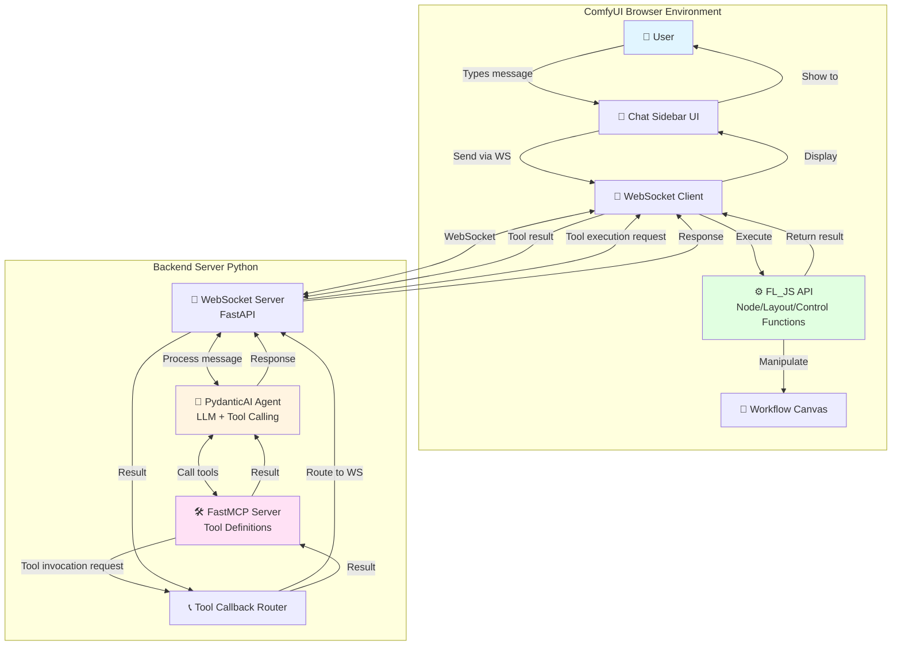
```mermaid
graph TB
    subgraph "ComfyUI Browser Environment"
        USER[👤 User]
        CHAT[💬 Chat Sidebar UI]
        CANVAS[🎨 Workflow Canvas]
        FLAPI[⚙️ FL_JS API<br/>Node/Layout/Control Functions]
        WSCLIENT[🔌 WebSocket Client]
    end
    
    subgraph "Backend Server Python"
        WSSERVER[🔌 WebSocket Server<br/>FastAPI]
        AGENT[🤖 PydanticAI Agent<br/>LLM + Tool Calling]
        MCP[🛠️ FastMCP Server<br/>Tool Definitions]
        CALLBACK[📞 Tool Callback Router]
    end
    
    USER -->|Types message| CHAT
    CHAT -->|Send via WS| WSCLIENT
    WSCLIENT <-->|WebSocket| WSSERVER
    WSSERVER <-->|Process message| AGENT
    AGENT <-->|Call tools| MCP
    MCP -->|Tool invocation request| CALLBACK
    CALLBACK -->|Route to WS| WSSERVER
    WSSERVER -->|Tool execution request| WSCLIENT
    WSCLIENT -->|Execute| FLAPI
    FLAPI -->|Manipulate| CANVAS
    FLAPI -->|Return result| WSCLIENT
    WSCLIENT -->|Tool result| WSSERVER
    WSSERVER -->|Result| CALLBACK
    CALLBACK -->|Result| MCP
    MCP -->|Result| AGENT
    AGENT -->|Response| WSSERVER
    WSSERVER -->|Response| WSCLIENT
    WSCLIENT -->|Display| CHAT
    CHAT -->|Show to| USER
    
    style USER fill:#e1f5ff
    style AGENT fill:#fff4e1
    style MCP fill:#ffe1f5
    style FLAPI fill:#e1ffe1
```

### Technology Stack Map

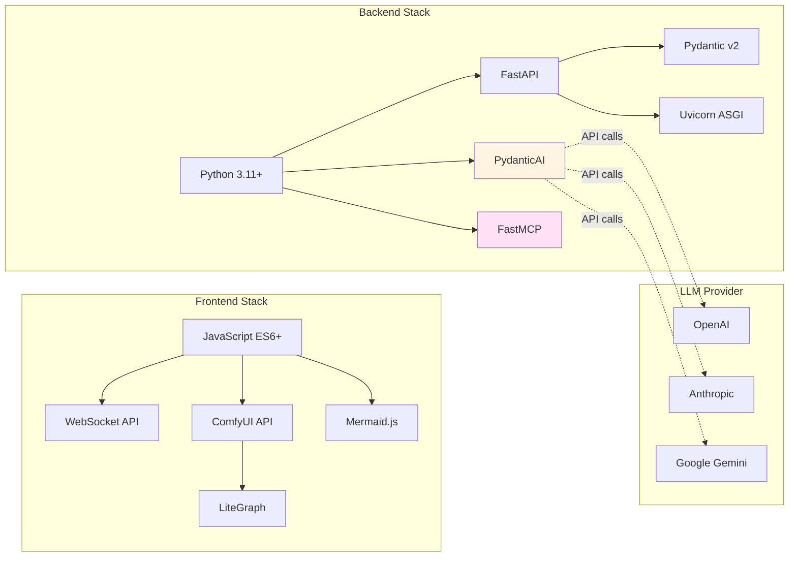
```mermaid
graph LR
    subgraph "Frontend Stack"
        JS[JavaScript ES6+]
        WS_API[WebSocket API]
        COMFY_API[ComfyUI API]
        MERMAID[Mermaid.js]
        LITEGRAPH[LiteGraph]
    end
    
    subgraph "Backend Stack"
        PYTHON[Python 3.11+]
        FASTAPI[FastAPI]
        PYDANTIC_AI[PydanticAI]
        FASTMCP[FastMCP]
        PYDANTIC[Pydantic v2]
        UVICORN[Uvicorn ASGI]
    end
    
    subgraph "LLM Provider"
        OPENAI[OpenAI]
        ANTHROPIC[Anthropic]
        GEMINI[Google Gemini]
    end
    
    JS --> WS_API
    JS --> COMFY_API
    JS --> MERMAID
    COMFY_API --> LITEGRAPH
    
    PYTHON --> FASTAPI
    PYTHON --> PYDANTIC_AI
    PYTHON --> FASTMCP
    FASTAPI --> PYDANTIC
    FASTAPI --> UVICORN
    
    PYDANTIC_AI -.->|API calls| OPENAI
    PYDANTIC_AI -.->|API calls| ANTHROPIC
    PYDANTIC_AI -.->|API calls| GEMINI
    
    style PYDANTIC_AI fill:#fff4e1
    style FASTMCP fill:#ffe1f5
```

---

## Component Architecture

### Frontend Components

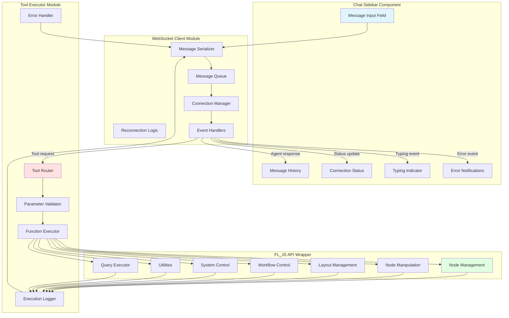
```mermaid
graph TD
    subgraph "Chat Sidebar Component"
        UI_INPUT[Message Input Field]
        UI_HISTORY[Message History]
        UI_STATUS[Connection Status]
        UI_TYPING[Typing Indicator]
        UI_ERROR[Error Notifications]
    end
    
    subgraph "WebSocket Client Module"
        WS_CONN[Connection Manager]
        WS_RECONNECT[Reconnection Logic]
        WS_SERIALIZE[Message Serializer]
        WS_HANDLERS[Event Handlers]
        WS_QUEUE[Message Queue]
    end
    
    subgraph "Tool Executor Module"
        TOOL_ROUTER[Tool Router]
        TOOL_VALIDATOR[Parameter Validator]
        TOOL_EXECUTOR[Function Executor]
        TOOL_ERROR[Error Handler]
        TOOL_LOGGER[Execution Logger]
    end
    
    subgraph "FL_JS API Wrapper"
        API_NODE[Node Management]
        API_MANIP[Node Manipulation]
        API_LAYOUT[Layout Management]
        API_WORKFLOW[Workflow Control]
        API_SYSTEM[System Control]
        API_UTIL[Utilities]
        API_QUERY[Query Executor]
    end
    
    UI_INPUT --> WS_SERIALIZE
    WS_SERIALIZE --> WS_QUEUE
    WS_QUEUE --> WS_CONN
    WS_CONN --> WS_HANDLERS
    
    WS_HANDLERS -->|Tool request| TOOL_ROUTER
    TOOL_ROUTER --> TOOL_VALIDATOR
    TOOL_VALIDATOR --> TOOL_EXECUTOR
    TOOL_EXECUTOR --> API_NODE
    TOOL_EXECUTOR --> API_MANIP
    TOOL_EXECUTOR --> API_LAYOUT
    TOOL_EXECUTOR --> API_WORKFLOW
    TOOL_EXECUTOR --> API_SYSTEM
    TOOL_EXECUTOR --> API_UTIL
    TOOL_EXECUTOR --> API_QUERY
    
    API_NODE --> TOOL_LOGGER
    API_MANIP --> TOOL_LOGGER
    API_LAYOUT --> TOOL_LOGGER
    API_WORKFLOW --> TOOL_LOGGER
    API_SYSTEM --> TOOL_LOGGER
    API_UTIL --> TOOL_LOGGER
    API_QUERY --> TOOL_LOGGER
    
    TOOL_LOGGER --> WS_SERIALIZE
    TOOL_ERROR --> WS_SERIALIZE
    
    WS_HANDLERS -->|Agent response| UI_HISTORY
    WS_HANDLERS -->|Status update| UI_STATUS
    WS_HANDLERS -->|Typing event| UI_TYPING
    WS_HANDLERS -->|Error event| UI_ERROR
    
    style UI_INPUT fill:#e1f5ff
    style TOOL_ROUTER fill:#ffe1e1
    style API_NODE fill:#e1ffe1
```

### Backend Components

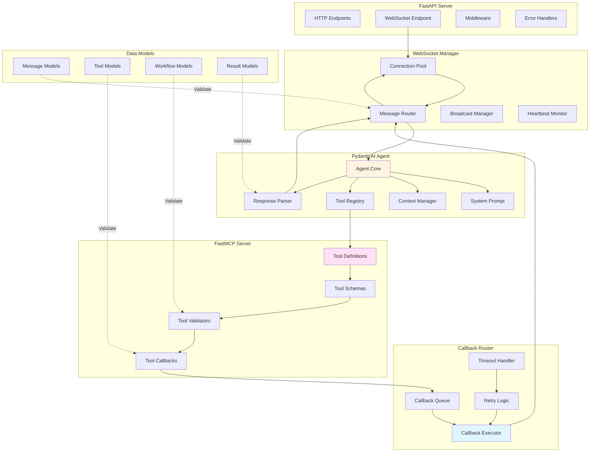
```mermaid
graph TD
    subgraph "FastAPI Server"
        HTTP[HTTP Endpoints]
        WS_ENDPOINT[WebSocket Endpoint]
        MIDDLEWARE[Middleware]
        ERROR_HANDLER[Error Handlers]
    end
    
    subgraph "WebSocket Manager"
        CONN_POOL[Connection Pool]
        MSG_ROUTER[Message Router]
        BROADCAST[Broadcast Manager]
        HEARTBEAT[Heartbeat Monitor]
    end
    
    subgraph "PydanticAI Agent"
        AGENT_CORE[Agent Core]
        SYSTEM_PROMPT[System Prompt]
        CONTEXT_MANAGER[Context Manager]
        TOOL_REGISTRY[Tool Registry]
        RESPONSE_PARSER[Response Parser]
    end
    
    subgraph "FastMCP Server"
        TOOL_DEFS[Tool Definitions]
        TOOL_SCHEMAS[Tool Schemas]
        TOOL_VALIDATORS[Tool Validators]
        TOOL_CALLBACKS[Tool Callbacks]
    end
    
    subgraph "Callback Router"
        CB_QUEUE[Callback Queue]
        CB_EXECUTOR[Callback Executor]
        CB_TIMEOUT[Timeout Handler]
        CB_RETRY[Retry Logic]
    end
    
    subgraph "Data Models"
        MSG_MODELS[Message Models]
        TOOL_MODELS[Tool Models]
        WORKFLOW_MODELS[Workflow Models]
        RESULT_MODELS[Result Models]
    end
    
    WS_ENDPOINT --> CONN_POOL
    CONN_POOL --> MSG_ROUTER
    MSG_ROUTER --> AGENT_CORE
    
    AGENT_CORE --> SYSTEM_PROMPT
    AGENT_CORE --> CONTEXT_MANAGER
    AGENT_CORE --> TOOL_REGISTRY
    
    TOOL_REGISTRY --> TOOL_DEFS
    TOOL_DEFS --> TOOL_SCHEMAS
    TOOL_SCHEMAS --> TOOL_VALIDATORS
    TOOL_VALIDATORS --> TOOL_CALLBACKS
    
    TOOL_CALLBACKS --> CB_QUEUE
    CB_QUEUE --> CB_EXECUTOR
    CB_EXECUTOR --> MSG_ROUTER
    MSG_ROUTER --> CONN_POOL
    
    AGENT_CORE --> RESPONSE_PARSER
    RESPONSE_PARSER --> MSG_ROUTER
    
    CB_TIMEOUT --> CB_RETRY
    CB_RETRY --> CB_EXECUTOR
    
    MSG_MODELS -.->|Validate| MSG_ROUTER
    TOOL_MODELS -.->|Validate| TOOL_CALLBACKS
    WORKFLOW_MODELS -.->|Validate| TOOL_VALIDATORS
    RESULT_MODELS -.->|Validate| RESPONSE_PARSER
    
    style AGENT_CORE fill:#fff4e1
    style TOOL_DEFS fill:#ffe1f5
    style CB_EXECUTOR fill:#e1f5ff
```

---

## Communication Flow

### Message Flow Sequence

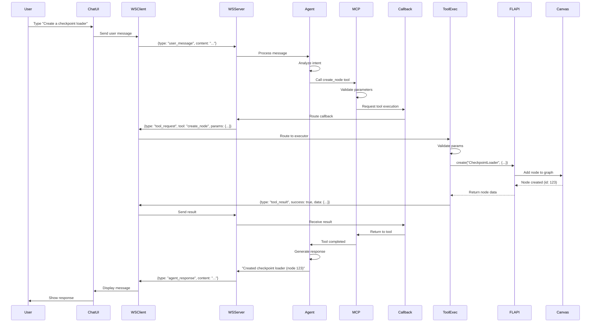
```mermaid
sequenceDiagram
    participant User
    participant ChatUI
    participant WSClient
    participant WSServer
    participant Agent
    participant MCP
    participant Callback
    participant ToolExec
    participant FLAPI
    participant Canvas
    
    User->>ChatUI: Type "Create a checkpoint loader"
    ChatUI->>WSClient: Send user message
    WSClient->>WSServer: {type: "user_message", content: "..."}
    WSServer->>Agent: Process message
    
    Agent->>Agent: Analyze intent
    Agent->>MCP: Call create_node tool
    MCP->>MCP: Validate parameters
    MCP->>Callback: Request tool execution
    Callback->>WSServer: Route callback
    WSServer->>WSClient: {type: "tool_request", tool: "create_node", params: {...}}
    
    WSClient->>ToolExec: Route to executor
    ToolExec->>ToolExec: Validate params
    ToolExec->>FLAPI: create("CheckpointLoader", {...})
    FLAPI->>Canvas: Add node to graph
    Canvas-->>FLAPI: Node created (id: 123)
    FLAPI-->>ToolExec: Return node data
    
    ToolExec->>WSClient: {type: "tool_result", success: true, data: {...}}
    WSClient->>WSServer: Send result
    WSServer->>Callback: Receive result
    Callback->>MCP: Return to tool
    MCP->>Agent: Tool completed
    
    Agent->>Agent: Generate response
    Agent->>WSServer: "Created checkpoint loader (node 123)"
    WSServer->>WSClient: {type: "agent_response", content: "..."}
    WSClient->>ChatUI: Display message
    ChatUI->>User: Show response
```

### Connection Lifecycle

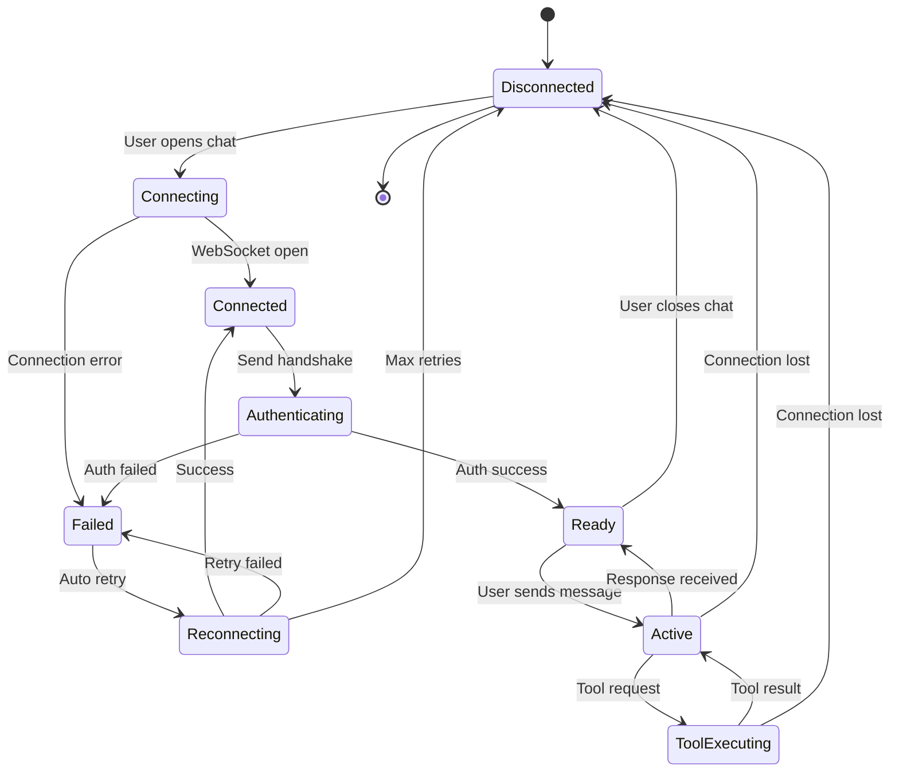
```mermaid
stateDiagram-v2
    [*] --> Disconnected
    
    Disconnected --> Connecting: User opens chat
    Connecting --> Connected: WebSocket open
    Connecting --> Failed: Connection error
    
    Failed --> Reconnecting: Auto retry
    Reconnecting --> Connected: Success
    Reconnecting --> Failed: Retry failed
    Reconnecting --> Disconnected: Max retries
    
    Connected --> Authenticating: Send handshake
    Authenticating --> Ready: Auth success
    Authenticating --> Failed: Auth failed
    
    Ready --> Active: User sends message
    Active --> Ready: Response received
    Active --> ToolExecuting: Tool request
    ToolExecuting --> Active: Tool result
    
    Ready --> Disconnected: User closes chat
    Active --> Disconnected: Connection lost
    ToolExecuting --> Disconnected: Connection lost
    
    Disconnected --> [*]
```

---

## Tool Execution Flow

### Complete Tool Execution Cycle

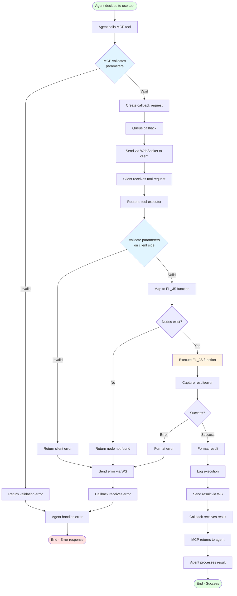
```mermaid
flowchart TD
    START([Agent decides to use tool])
    
    START --> AGENT_CALL[Agent calls MCP tool]
    AGENT_CALL --> MCP_VALIDATE{MCP validates<br/>parameters}
    
    MCP_VALIDATE -->|Invalid| MCP_ERROR[Return validation error]
    MCP_ERROR --> AGENT_HANDLE[Agent handles error]
    AGENT_HANDLE --> END_ERROR([End - Error response])
    
    MCP_VALIDATE -->|Valid| CREATE_CALLBACK[Create callback request]
    CREATE_CALLBACK --> QUEUE_CB[Queue callback]
    QUEUE_CB --> SEND_WS[Send via WebSocket to client]
    
    SEND_WS --> WS_RECEIVE[Client receives tool request]
    WS_RECEIVE --> ROUTE[Route to tool executor]
    ROUTE --> VALIDATE_CLIENT{Validate parameters<br/>on client side}
    
    VALIDATE_CLIENT -->|Invalid| CLIENT_ERROR[Return client error]
    CLIENT_ERROR --> SEND_ERROR[Send error via WS]
    SEND_ERROR --> CB_ERROR[Callback receives error]
    CB_ERROR --> AGENT_HANDLE
    
    VALIDATE_CLIENT -->|Valid| MAP_FUNCTION[Map to FL_JS function]
    MAP_FUNCTION --> CHECK_NODES{Nodes exist?}
    
    CHECK_NODES -->|No| NODE_ERROR[Return node not found]
    NODE_ERROR --> SEND_ERROR
    
    CHECK_NODES -->|Yes| EXECUTE[Execute FL_JS function]
    EXECUTE --> CAPTURE[Capture result/error]
    
    CAPTURE --> TRY_CATCH{Success?}
    TRY_CATCH -->|Error| EXEC_ERROR[Format error]
    EXEC_ERROR --> SEND_ERROR
    
    TRY_CATCH -->|Success| FORMAT_RESULT[Format result]
    FORMAT_RESULT --> LOG[Log execution]
    LOG --> SEND_RESULT[Send result via WS]
    
    SEND_RESULT --> CB_RECEIVE[Callback receives result]
    CB_RECEIVE --> MCP_RETURN[MCP returns to agent]
    MCP_RETURN --> AGENT_PROCESS[Agent processes result]
    AGENT_PROCESS --> END_SUCCESS([End - Success])
    
    style START fill:#e1ffe1
    style END_SUCCESS fill:#e1ffe1
    style END_ERROR fill:#ffe1e1
    style EXECUTE fill:#fff4e1
    style MCP_VALIDATE fill:#e1f5ff
    style VALIDATE_CLIENT fill:#e1f5ff
```

### Tool Categories & Mapping

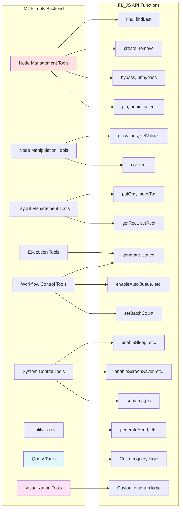
```mermaid
graph LR
    subgraph "MCP Tools Backend"
        T_NODE[Node Management Tools]
        T_MANIP[Node Manipulation Tools]
        T_LAYOUT[Layout Management Tools]
        T_WORKFLOW[Workflow Control Tools]
        T_SYSTEM[System Control Tools]
        T_UTIL[Utility Tools]
        T_QUERY[Query Tools]
        T_VIZ[Visualization Tools]
        T_EXEC[Execution Tools]
    end
    
    subgraph "FL_JS API Functions"
        F_FIND[find, findLast]
        F_CREATE[create, remove]
        F_BYPASS[bypass, unbypass]
        F_PIN[pin, unpin, select]
        F_VALUES[getValues, setValues]
        F_CONNECT[connect]
        F_POSITION[putOn*, moveTo*]
        F_RECT[getRect, setRect]
        F_GEN[generate, cancel]
        F_QUEUE[enableAutoQueue, etc.]
        F_BATCH[setBatchCount]
        F_SLEEP[enableSleep, etc.]
        F_SCREEN[enableScreenSaver, etc.]
        F_IMAGES[sendImages]
        F_RANDOM[generateSeed, etc.]
        F_QUERY[Custom query logic]
        F_DIAGRAM[Custom diagram logic]
    end
    
    T_NODE --> F_FIND
    T_NODE --> F_CREATE
    T_NODE --> F_BYPASS
    T_NODE --> F_PIN
    
    T_MANIP --> F_VALUES
    T_MANIP --> F_CONNECT
    
    T_LAYOUT --> F_POSITION
    T_LAYOUT --> F_RECT
    
    T_WORKFLOW --> F_GEN
    T_WORKFLOW --> F_QUEUE
    T_WORKFLOW --> F_BATCH
    
    T_SYSTEM --> F_SLEEP
    T_SYSTEM --> F_SCREEN
    T_SYSTEM --> F_IMAGES
    
    T_UTIL --> F_RANDOM
    
    T_QUERY --> F_QUERY
    T_VIZ --> F_DIAGRAM
    T_EXEC --> F_GEN
    
    style T_NODE fill:#ffe1e1
    style T_QUERY fill:#e1f5ff
    style T_VIZ fill:#ffe1f5
```

---

## WebSocket Message Protocol

### Message Types

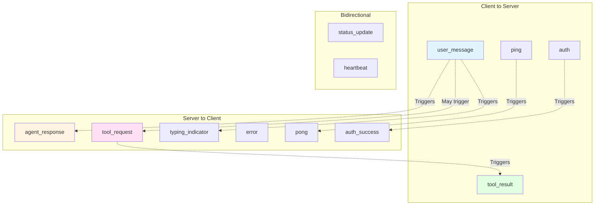
```mermaid
graph TD
    subgraph "Client to Server"
        C_USER[user_message]
        C_TOOL_RESULT[tool_result]
        C_PING[ping]
        C_AUTH[auth]
    end
    
    subgraph "Server to Client"
        S_AGENT[agent_response]
        S_TOOL_REQ[tool_request]
        S_TYPING[typing_indicator]
        S_ERROR[error]
        S_PONG[pong]
        S_AUTH_OK[auth_success]
    end
    
    subgraph "Bidirectional"
        B_STATUS[status_update]
        B_HEARTBEAT[heartbeat]
    end
    
    C_USER -.->|Triggers| S_TYPING
    C_USER -.->|Triggers| S_AGENT
    C_USER -.->|May trigger| S_TOOL_REQ
    
    S_TOOL_REQ -.->|Triggers| C_TOOL_RESULT
    
    C_PING -.->|Triggers| S_PONG
    C_AUTH -.->|Triggers| S_AUTH_OK
    
    style C_USER fill:#e1f5ff
    style S_AGENT fill:#fff4e1
    style S_TOOL_REQ fill:#ffe1f5
    style C_TOOL_RESULT fill:#e1ffe1
```

### Message Schemas

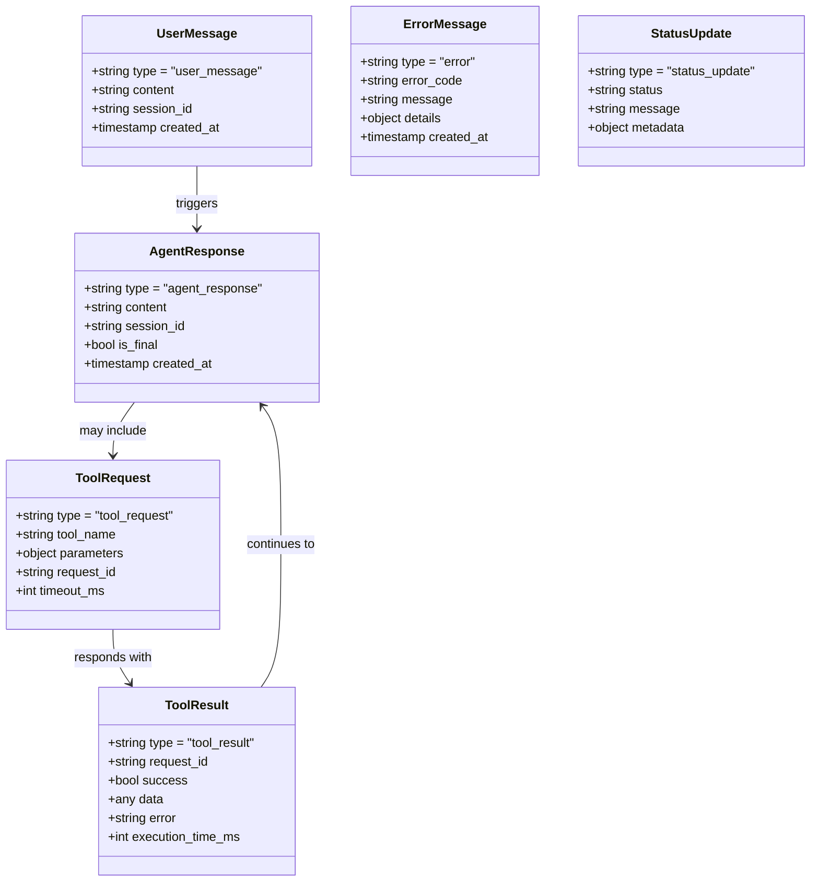
```mermaid
classDiagram
    class UserMessage {
        +string type = "user_message"
        +string content
        +string session_id
        +timestamp created_at
    }
    
    class AgentResponse {
        +string type = "agent_response"
        +string content
        +string session_id
        +bool is_final
        +timestamp created_at
    }
    
    class ToolRequest {
        +string type = "tool_request"
        +string tool_name
        +object parameters
        +string request_id
        +int timeout_ms
    }
    
    class ToolResult {
        +string type = "tool_result"
        +string request_id
        +bool success
        +any data
        +string error
        +int execution_time_ms
    }
    
    class ErrorMessage {
        +string type = "error"
        +string error_code
        +string message
        +object details
        +timestamp created_at
    }
    
    class StatusUpdate {
        +string type = "status_update"
        +string status
        +string message
        +object metadata
    }
    
    UserMessage --> AgentResponse : triggers
    AgentResponse --> ToolRequest : may include
    ToolRequest --> ToolResult : responds with
    ToolResult --> AgentResponse : continues to
```

---

## Agent Decision Flow

### Agent Processing Pipeline

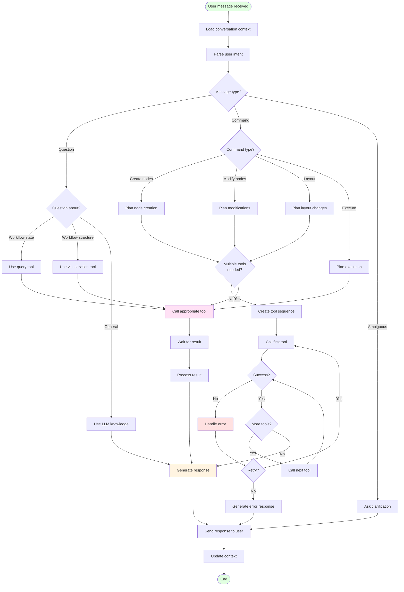
```mermaid
flowchart TD
    START([User message received])
    
    START --> LOAD_CONTEXT[Load conversation context]
    LOAD_CONTEXT --> PARSE[Parse user intent]
    
    PARSE --> CLASSIFY{Message type?}
    
    CLASSIFY -->|Question| Q_TYPE{Question about?}
    Q_TYPE -->|Workflow state| USE_QUERY[Use query tool]
    Q_TYPE -->|Workflow structure| USE_VIZ[Use visualization tool]
    Q_TYPE -->|General| USE_KNOWLEDGE[Use LLM knowledge]
    
    CLASSIFY -->|Command| C_TYPE{Command type?}
    C_TYPE -->|Create nodes| PLAN_CREATE[Plan node creation]
    C_TYPE -->|Modify nodes| PLAN_MODIFY[Plan modifications]
    C_TYPE -->|Layout| PLAN_LAYOUT[Plan layout changes]
    C_TYPE -->|Execute| PLAN_EXEC[Plan execution]
    
    CLASSIFY -->|Ambiguous| ASK_CLARIFY[Ask clarification]
    ASK_CLARIFY --> SEND_RESPONSE
    
    USE_QUERY --> CALL_TOOL[Call appropriate tool]
    USE_VIZ --> CALL_TOOL
    USE_KNOWLEDGE --> GENERATE[Generate response]
    
    PLAN_CREATE --> MULTI_TOOL{Multiple tools<br/>needed?}
    PLAN_MODIFY --> MULTI_TOOL
    PLAN_LAYOUT --> MULTI_TOOL
    PLAN_EXEC --> CALL_TOOL
    
    MULTI_TOOL -->|Yes| SEQUENCE[Create tool sequence]
    MULTI_TOOL -->|No| CALL_TOOL
    
    SEQUENCE --> CALL_FIRST[Call first tool]
    CALL_FIRST --> CHECK_RESULT{Success?}
    
    CHECK_RESULT -->|No| HANDLE_ERROR[Handle error]
    HANDLE_ERROR --> RETRY{Retry?}
    RETRY -->|Yes| CALL_FIRST
    RETRY -->|No| ERROR_RESPONSE[Generate error response]
    ERROR_RESPONSE --> SEND_RESPONSE
    
    CHECK_RESULT -->|Yes| MORE_TOOLS{More tools?}
    MORE_TOOLS -->|Yes| CALL_NEXT[Call next tool]
    CALL_NEXT --> CHECK_RESULT
    MORE_TOOLS -->|No| GENERATE
    
    CALL_TOOL --> WAIT[Wait for result]
    WAIT --> PROCESS[Process result]
    PROCESS --> GENERATE
    
    GENERATE --> SEND_RESPONSE[Send response to user]
    SEND_RESPONSE --> UPDATE_CONTEXT[Update context]
    UPDATE_CONTEXT --> END([End])
    
    style START fill:#e1ffe1
    style END fill:#e1ffe1
    style CALL_TOOL fill:#ffe1f5
    style GENERATE fill:#fff4e1
    style HANDLE_ERROR fill:#ffe1e1
```

### Tool Selection Logic

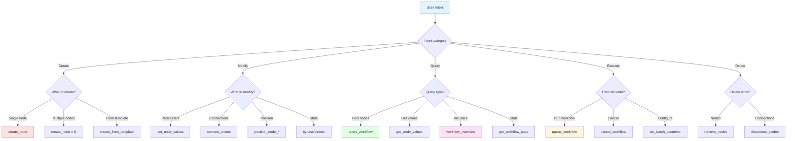
```mermaid
graph TD
    INTENT[User Intent]
    
    INTENT --> I1{Intent category}
    
    I1 -->|Create| C1{What to create?}
    C1 -->|Single node| T_CREATE[create_node]
    C1 -->|Multiple nodes| T_CREATE_MULTI[create_node x N]
    C1 -->|From template| T_TEMPLATE[create_from_template]
    
    I1 -->|Modify| M1{What to modify?}
    M1 -->|Parameters| T_SET_VALUES[set_node_values]
    M1 -->|Connections| T_CONNECT[connect_nodes]
    M1 -->|Position| T_POSITION[position_node_*]
    M1 -->|State| T_BYPASS[bypass/pin/etc]
    
    I1 -->|Query| Q1{Query type?}
    Q1 -->|Find nodes| T_QUERY[query_workflow]
    Q1 -->|Get values| T_GET_VALUES[get_node_values]
    Q1 -->|Visualize| T_VIZ[workflow_overview]
    Q1 -->|Stats| T_STATS[get_workflow_stats]
    
    I1 -->|Execute| E1{Execute what?}
    E1 -->|Run workflow| T_QUEUE[queue_workflow]
    E1 -->|Cancel| T_CANCEL[cancel_workflow]
    E1 -->|Configure| T_CONFIG[set_batch_count/etc]
    
    I1 -->|Delete| D1{Delete what?}
    D1 -->|Nodes| T_REMOVE[remove_nodes]
    D1 -->|Connections| T_DISCONNECT[disconnect_nodes]
    
    style INTENT fill:#e1f5ff
    style T_CREATE fill:#ffe1e1
    style T_QUERY fill:#e1ffe1
    style T_VIZ fill:#ffe1f5
    style T_QUEUE fill:#fff4e1
```

---

## Query System Architecture

### Query Processing Flow

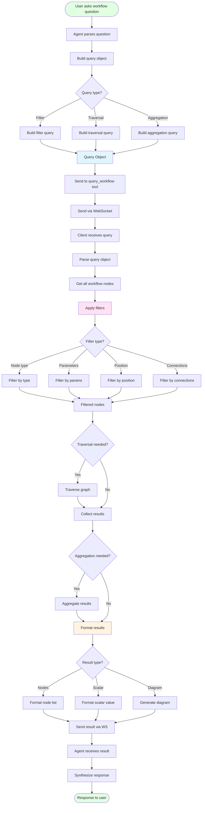
```mermaid
flowchart TD
    START([User asks workflow question])
    
    START --> AGENT_PARSE[Agent parses question]
    AGENT_PARSE --> BUILD_QUERY[Build query object]
    
    BUILD_QUERY --> QUERY_TYPE{Query type?}
    
    QUERY_TYPE -->|Filter| BUILD_FILTER[Build filter query]
    QUERY_TYPE -->|Traversal| BUILD_TRAVERSAL[Build traversal query]
    QUERY_TYPE -->|Aggregation| BUILD_AGG[Build aggregation query]
    
    BUILD_FILTER --> QUERY_OBJ[Query Object]
    BUILD_TRAVERSAL --> QUERY_OBJ
    BUILD_AGG --> QUERY_OBJ
    
    QUERY_OBJ --> SEND_TOOL[Send to query_workflow tool]
    SEND_TOOL --> WS_SEND[Send via WebSocket]
    WS_SEND --> CLIENT_RECEIVE[Client receives query]
    
    CLIENT_RECEIVE --> PARSE_QUERY[Parse query object]
    PARSE_QUERY --> GET_NODES[Get all workflow nodes]
    GET_NODES --> APPLY_FILTERS[Apply filters]
    
    APPLY_FILTERS --> FILTER_TYPE{Filter type?}
    FILTER_TYPE -->|Node type| FILTER_TYPE_NODES[Filter by type]
    FILTER_TYPE -->|Parameters| FILTER_PARAMS[Filter by params]
    FILTER_TYPE -->|Position| FILTER_POSITION[Filter by position]
    FILTER_TYPE -->|Connections| FILTER_CONN[Filter by connections]
    
    FILTER_TYPE_NODES --> FILTERED
    FILTER_PARAMS --> FILTERED
    FILTER_POSITION --> FILTERED
    FILTER_CONN --> FILTERED
    
    FILTERED[Filtered nodes] --> TRAVERSAL{Traversal needed?}
    TRAVERSAL -->|Yes| TRAVERSE[Traverse graph]
    TRAVERSE --> COLLECT
    TRAVERSAL -->|No| COLLECT[Collect results]
    
    COLLECT --> AGGREGATION{Aggregation needed?}
    AGGREGATION -->|Yes| AGGREGATE[Aggregate results]
    AGGREGATE --> FORMAT
    AGGREGATION -->|No| FORMAT[Format results]
    
    FORMAT --> RESULT_TYPE{Result type?}
    RESULT_TYPE -->|Nodes| FORMAT_NODES[Format node list]
    RESULT_TYPE -->|Scalar| FORMAT_SCALAR[Format scalar value]
    RESULT_TYPE -->|Diagram| FORMAT_DIAGRAM[Generate diagram]
    
    FORMAT_NODES --> SEND_RESULT
    FORMAT_SCALAR --> SEND_RESULT
    FORMAT_DIAGRAM --> SEND_RESULT
    
    SEND_RESULT[Send result via WS] --> AGENT_RECEIVE[Agent receives result]
    AGENT_RECEIVE --> SYNTHESIZE[Synthesize response]
    SYNTHESIZE --> END([Response to user])
    
    style START fill:#e1ffe1
    style END fill:#e1ffe1
    style QUERY_OBJ fill:#e1f5ff
    style APPLY_FILTERS fill:#ffe1f5
    style FORMAT fill:#fff4e1
```

### Query Object Structure

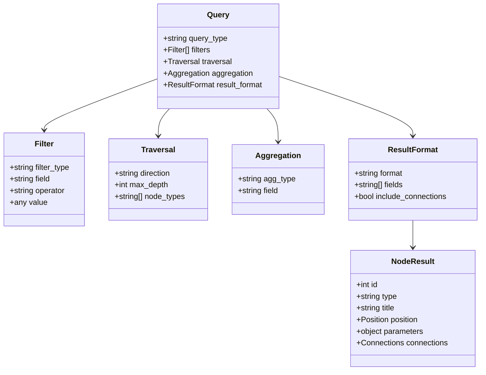
```mermaid
classDiagram
    class Query {
        +string query_type
        +Filter[] filters
        +Traversal traversal
        +Aggregation aggregation
        +ResultFormat result_format
    }
    
    class Filter {
        +string filter_type
        +string field
        +string operator
        +any value
    }
    
    class Traversal {
        +string direction
        +int max_depth
        +string[] node_types
    }
    
    class Aggregation {
        +string agg_type
        +string field
    }
    
    class ResultFormat {
        +string format
        +string[] fields
        +bool include_connections
    }
    
    class NodeResult {
        +int id
        +string type
        +string title
        +Position position
        +object parameters
        +Connections connections
    }
    
    Query --> Filter
    Query --> Traversal
    Query --> Aggregation
    Query --> ResultFormat
    ResultFormat --> NodeResult
```

### Example Query: "Find all KSampler nodes"

```mermaid
sequenceDiagram
    participant User
    participant Agent
    participant Query Tool
    participant JS Client
    participant Workflow
    
    User->>Agent: "Find all KSampler nodes"
    Agent->>Agent: Parse intent
    Agent->>Query Tool: query_workflow({<br/>  type: "filter",<br/>  filters: [{<br/>    field: "type",<br/>    operator: "equals",<br/>    value: "KSampler"<br/>  }]<br/>})
    Query Tool->>JS Client: Tool request via WS
    JS Client->>Workflow: Get all nodes
    Workflow-->>JS Client: Node list
    JS Client->>JS Client: Filter nodes where type === "KSampler"
    JS Client->>JS Client: Format results
    JS Client-->>Query Tool: [
      {id: 5, type: "KSampler", title: "Sampler", ...},
      {id: 12, type: "KSampler", title: "Sampler 2", ...}
    ]
    Query Tool-->>Agent: Tool result
    Agent->>Agent: Generate response
    Agent-->>User: "Found 2 KSampler nodes: node 5 and node 12"
```

---

## Execution & Feedback Loop

### Workflow Execution Flow

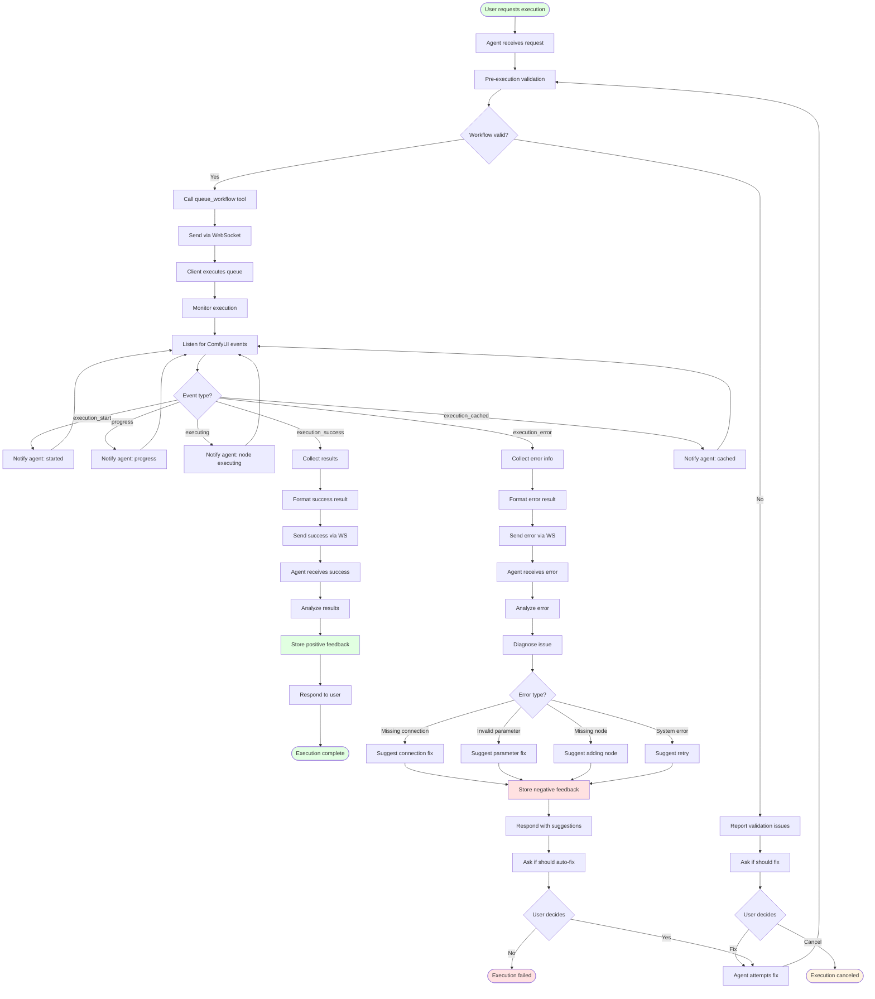
```mermaid
flowchart TD
    START([User requests execution])
    
    START --> AGENT_RECEIVE[Agent receives request]
    AGENT_RECEIVE --> PRE_VALIDATE[Pre-execution validation]
    
    PRE_VALIDATE --> VALIDATE{Workflow valid?}
    VALIDATE -->|No| REPORT_ISSUES[Report validation issues]
    REPORT_ISSUES --> ASK_FIX[Ask if should fix]
    ASK_FIX --> USER_DECIDES{User decides}
    USER_DECIDES -->|Fix| AUTO_FIX[Agent attempts fix]
    AUTO_FIX --> PRE_VALIDATE
    USER_DECIDES -->|Cancel| END_CANCEL([Execution canceled])
    
    VALIDATE -->|Yes| CALL_QUEUE[Call queue_workflow tool]
    CALL_QUEUE --> WS_SEND[Send via WebSocket]
    WS_SEND --> CLIENT_EXEC[Client executes queue]
    
    CLIENT_EXEC --> MONITOR[Monitor execution]
    MONITOR --> LISTEN[Listen for ComfyUI events]
    
    LISTEN --> EVENT{Event type?}
    EVENT -->|execution_start| NOTIFY_START[Notify agent: started]
    EVENT -->|progress| NOTIFY_PROGRESS[Notify agent: progress]
    EVENT -->|executing| NOTIFY_NODE[Notify agent: node executing]
    EVENT -->|execution_success| COLLECT_SUCCESS[Collect results]
    EVENT -->|execution_error| COLLECT_ERROR[Collect error info]
    EVENT -->|execution_cached| NOTIFY_CACHED[Notify agent: cached]
    
    NOTIFY_START --> LISTEN
    NOTIFY_PROGRESS --> LISTEN
    NOTIFY_NODE --> LISTEN
    NOTIFY_CACHED --> LISTEN
    
    COLLECT_SUCCESS --> FORMAT_SUCCESS[Format success result]
    FORMAT_SUCCESS --> SEND_SUCCESS[Send success via WS]
    SEND_SUCCESS --> AGENT_SUCCESS[Agent receives success]
    AGENT_SUCCESS --> ANALYZE_SUCCESS[Analyze results]
    ANALYZE_SUCCESS --> POSITIVE_FEEDBACK[Store positive feedback]
    POSITIVE_FEEDBACK --> RESPOND_SUCCESS[Respond to user]
    RESPOND_SUCCESS --> END_SUCCESS([Execution complete])
    
    COLLECT_ERROR --> FORMAT_ERROR[Format error result]
    FORMAT_ERROR --> SEND_ERROR[Send error via WS]
    SEND_ERROR --> AGENT_ERROR[Agent receives error]
    AGENT_ERROR --> ANALYZE_ERROR[Analyze error]
    ANALYZE_ERROR --> DIAGNOSE[Diagnose issue]
    
    DIAGNOSE --> ERROR_TYPE{Error type?}
    ERROR_TYPE -->|Missing connection| SUGGEST_FIX_CONN[Suggest connection fix]
    ERROR_TYPE -->|Invalid parameter| SUGGEST_FIX_PARAM[Suggest parameter fix]
    ERROR_TYPE -->|Missing node| SUGGEST_FIX_NODE[Suggest adding node]
    ERROR_TYPE -->|System error| SUGGEST_RETRY[Suggest retry]
    
    SUGGEST_FIX_CONN --> NEGATIVE_FEEDBACK
    SUGGEST_FIX_PARAM --> NEGATIVE_FEEDBACK
    SUGGEST_FIX_NODE --> NEGATIVE_FEEDBACK
    SUGGEST_RETRY --> NEGATIVE_FEEDBACK
    
    NEGATIVE_FEEDBACK[Store negative feedback] --> RESPOND_ERROR[Respond with suggestions]
    RESPOND_ERROR --> ASK_AUTO_FIX[Ask if should auto-fix]
    ASK_AUTO_FIX --> USER_FIX{User decides}
    USER_FIX -->|Yes| AUTO_FIX
    USER_FIX -->|No| END_ERROR([Execution failed])
    
    style START fill:#e1ffe1
    style END_SUCCESS fill:#e1ffe1
    style END_ERROR fill:#ffe1e1
    style END_CANCEL fill:#fff4e1
    style POSITIVE_FEEDBACK fill:#e1ffe1
    style NEGATIVE_FEEDBACK fill:#ffe1e1
```

### Feedback Storage & Learning

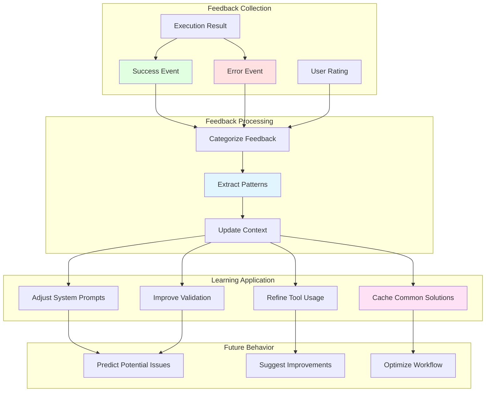
```mermaid
graph TD
    subgraph "Feedback Collection"
        EXEC_RESULT[Execution Result]
        SUCCESS[Success Event]
        ERROR[Error Event]
        USER_RATING[User Rating]
    end
    
    subgraph "Feedback Processing"
        CATEGORIZE[Categorize Feedback]
        EXTRACT_PATTERNS[Extract Patterns]
        UPDATE_CONTEXT[Update Context]
    end
    
    subgraph "Learning Application"
        ADJUST_PROMPTS[Adjust System Prompts]
        REFINE_TOOLS[Refine Tool Usage]
        IMPROVE_VALIDATION[Improve Validation]
        CACHE_SOLUTIONS[Cache Common Solutions]
    end
    
    subgraph "Future Behavior"
        PREDICT_ISSUES[Predict Potential Issues]
        SUGGEST_IMPROVEMENTS[Suggest Improvements]
        OPTIMIZE_WORKFLOW[Optimize Workflow]
    end
    
    EXEC_RESULT --> SUCCESS
    EXEC_RESULT --> ERROR
    SUCCESS --> CATEGORIZE
    ERROR --> CATEGORIZE
    USER_RATING --> CATEGORIZE
    
    CATEGORIZE --> EXTRACT_PATTERNS
    EXTRACT_PATTERNS --> UPDATE_CONTEXT
    
    UPDATE_CONTEXT --> ADJUST_PROMPTS
    UPDATE_CONTEXT --> REFINE_TOOLS
    UPDATE_CONTEXT --> IMPROVE_VALIDATION
    UPDATE_CONTEXT --> CACHE_SOLUTIONS
    
    ADJUST_PROMPTS --> PREDICT_ISSUES
    REFINE_TOOLS --> SUGGEST_IMPROVEMENTS
    IMPROVE_VALIDATION --> PREDICT_ISSUES
    CACHE_SOLUTIONS --> OPTIMIZE_WORKFLOW
    
    style SUCCESS fill:#e1ffe1
    style ERROR fill:#ffe1e1
    style EXTRACT_PATTERNS fill:#e1f5ff
    style CACHE_SOLUTIONS fill:#ffe1f5
```

---

## ComfyUI Integration

### How FL_JS Fits in ComfyUI

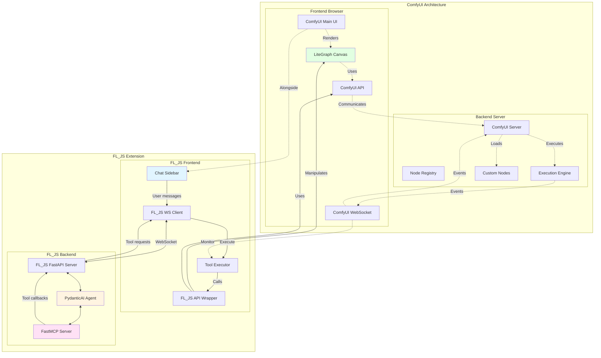
```mermaid
graph TB
    subgraph "ComfyUI Architecture"
        subgraph "Frontend Browser"
            COMFY_UI[ComfyUI Main UI]
            LITEGRAPH[LiteGraph Canvas]
            COMFY_API[ComfyUI API]
            COMFY_WS[ComfyUI WebSocket]
        end
        
        subgraph "Backend Server"
            COMFY_SERVER[ComfyUI Server]
            NODE_REGISTRY[Node Registry]
            EXECUTION_ENGINE[Execution Engine]
            CUSTOM_NODES[Custom Nodes]
        end
    end
    
    subgraph "FL_JS Extension"
        subgraph "FL_JS Frontend"
            CHAT_SIDEBAR[Chat Sidebar]
            FL_WS_CLIENT[FL_JS WS Client]
            FL_API_WRAPPER[FL_JS API Wrapper]
            TOOL_EXECUTOR[Tool Executor]
        end
        
        subgraph "FL_JS Backend"
            FL_SERVER[FL_JS FastAPI Server]
            FL_AGENT[PydanticAI Agent]
            FL_MCP[FastMCP Server]
        end
    end
    
    COMFY_UI -.->|Renders| LITEGRAPH
    COMFY_UI -.->|Alongside| CHAT_SIDEBAR
    LITEGRAPH -.->|Uses| COMFY_API
    COMFY_API -.->|Communicates| COMFY_SERVER
    COMFY_WS -.->|Events| COMFY_SERVER
    
    CHAT_SIDEBAR -->|User messages| FL_WS_CLIENT
    FL_WS_CLIENT <-->|WebSocket| FL_SERVER
    FL_SERVER <--> FL_AGENT
    FL_AGENT <--> FL_MCP
    FL_MCP -->|Tool callbacks| FL_SERVER
    FL_SERVER -->|Tool requests| FL_WS_CLIENT
    FL_WS_CLIENT -->|Execute| TOOL_EXECUTOR
    TOOL_EXECUTOR -->|Calls| FL_API_WRAPPER
    FL_API_WRAPPER -->|Manipulates| LITEGRAPH
    FL_API_WRAPPER -->|Uses| COMFY_API
    
    COMFY_SERVER -.->|Loads| CUSTOM_NODES
    COMFY_SERVER -.->|Executes| EXECUTION_ENGINE
    EXECUTION_ENGINE -.->|Events| COMFY_WS
    COMFY_WS -.->|Monitor| TOOL_EXECUTOR
    
    style CHAT_SIDEBAR fill:#e1f5ff
    style FL_AGENT fill:#fff4e1
    style FL_MCP fill:#ffe1f5
    style LITEGRAPH fill:#e1ffe1
```

### ComfyUI Event Hooks

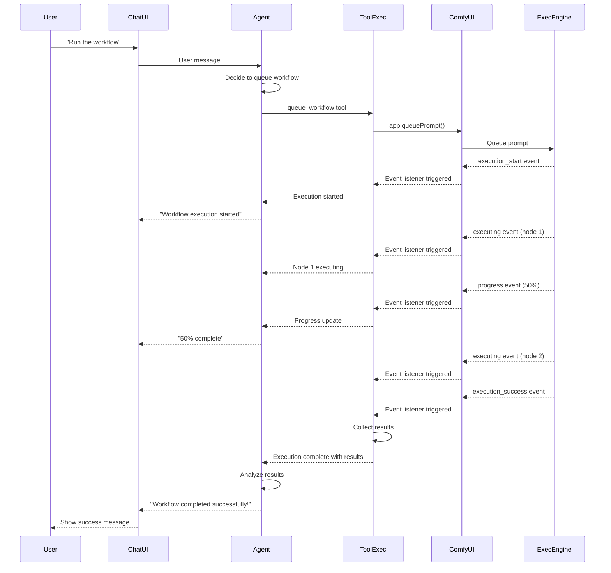
```mermaid
sequenceDiagram
    participant User
    participant ChatUI
    participant Agent
    participant ToolExec
    participant ComfyUI
    participant ExecEngine
    
    User->>ChatUI: "Run the workflow"
    ChatUI->>Agent: User message
    Agent->>Agent: Decide to queue workflow
    Agent->>ToolExec: queue_workflow tool
    ToolExec->>ComfyUI: app.queuePrompt()
    ComfyUI->>ExecEngine: Queue prompt
    
    ExecEngine-->>ComfyUI: execution_start event
    ComfyUI-->>ToolExec: Event listener triggered
    ToolExec-->>Agent: Execution started
    Agent-->>ChatUI: "Workflow execution started"
    
    ExecEngine-->>ComfyUI: executing event (node 1)
    ComfyUI-->>ToolExec: Event listener triggered
    ToolExec-->>Agent: Node 1 executing
    
    ExecEngine-->>ComfyUI: progress event (50%)
    ComfyUI-->>ToolExec: Event listener triggered
    ToolExec-->>Agent: Progress update
    Agent-->>ChatUI: "50% complete"
    
    ExecEngine-->>ComfyUI: executing event (node 2)
    ComfyUI-->>ToolExec: Event listener triggered
    
    ExecEngine-->>ComfyUI: execution_success event
    ComfyUI-->>ToolExec: Event listener triggered
    ToolExec->>ToolExec: Collect results
    ToolExec-->>Agent: Execution complete with results
    Agent->>Agent: Analyze results
    Agent-->>ChatUI: "Workflow completed successfully!"
    ChatUI-->>User: Show success message
```

### Node Graph Manipulation

```mermaid
flowchart LR
    subgraph "Agent Action"
        AGENT[Agent decides:<br/>"Create checkpoint loader"]
    end
    
    subgraph "Tool Execution"
        TOOL[create_node tool]
        PARAMS[Parameters:<br/>type: "CheckpointLoaderSimple"<br/>values: {ckpt_name: "sd15.safetensors"}]
    end
    
    subgraph "FL_JS API"
        CREATE[create function]
        NODE_DATA[Node data structure]
    end
    
    subgraph "LiteGraph"
        GRAPH[app.graph]
        ADD_NODE[graph.add]
        NODE_INSTANCE[LGraphNode instance]
    end
    
    subgraph "ComfyUI Canvas"
        CANVAS[Canvas]
        RENDER[Render node]
        DISPLAY[Visual node on canvas]
    end
    
    AGENT --> TOOL
    TOOL --> PARAMS
    PARAMS --> CREATE
    CREATE --> NODE_DATA
    NODE_DATA --> GRAPH
    GRAPH --> ADD_NODE
    ADD_NODE --> NODE_INSTANCE
    NODE_INSTANCE --> CANVAS
    CANVAS --> RENDER
    RENDER --> DISPLAY
    
    style AGENT fill:#fff4e1
    style TOOL fill:#ffe1f5
    style CREATE fill:#e1f5ff
    style DISPLAY fill:#e1ffe1
```

---

## Data Flow Examples

### Example 1: Create Simple Workflow

```mermaid
sequenceDiagram
    participant User
    participant Agent
    participant create_node
    participant connect_nodes
    participant FLAPI
    participant Canvas
    
    User->>Agent: "Create a simple text-to-image workflow"
    Agent->>Agent: Plan: Need checkpoint, clip, sampler, vae, save
    
    Agent->>create_node: Create CheckpointLoaderSimple
    create_node->>FLAPI: create("CheckpointLoaderSimple", {...})
    FLAPI->>Canvas: Add node (id: 1)
    Canvas-->>FLAPI: Node created
    FLAPI-->>create_node: {id: 1, type: "CheckpointLoaderSimple"}
    create_node-->>Agent: Success
    
    Agent->>create_node: Create CLIPTextEncode (positive)
    create_node->>FLAPI: create("CLIPTextEncode", {...})
    FLAPI->>Canvas: Add node (id: 2)
    Canvas-->>FLAPI: Node created
    FLAPI-->>create_node: {id: 2, type: "CLIPTextEncode"}
    create_node-->>Agent: Success
    
    Agent->>create_node: Create CLIPTextEncode (negative)
    create_node->>FLAPI: create("CLIPTextEncode", {...})
    FLAPI->>Canvas: Add node (id: 3)
    Canvas-->>FLAPI: Node created
    FLAPI-->>create_node: {id: 3, type: "CLIPTextEncode"}
    create_node-->>Agent: Success
    
    Agent->>create_node: Create KSampler
    create_node->>FLAPI: create("KSampler", {...})
    FLAPI->>Canvas: Add node (id: 4)
    Canvas-->>FLAPI: Node created
    FLAPI-->>create_node: {id: 4, type: "KSampler"}
    create_node-->>Agent: Success
    
    Agent->>create_node: Create VAEDecode
    create_node->>FLAPI: create("VAEDecode", {...})
    FLAPI->>Canvas: Add node (id: 5)
    Canvas-->>FLAPI: Node created
    FLAPI-->>create_node: {id: 5, type: "VAEDecode"}
    create_node-->>Agent: Success
    
    Agent->>create_node: Create SaveImage
    create_node->>FLAPI: create("SaveImage", {...})
    FLAPI->>Canvas: Add node (id: 6)
    Canvas-->>FLAPI: Node created
    FLAPI-->>create_node: {id: 6, type: "SaveImage"}
    create_node-->>Agent: Success
    
    Note over Agent: Now connect nodes
    
    Agent->>connect_nodes: Connect 1.MODEL -> 4.model
    connect_nodes->>FLAPI: connect(1, "MODEL", 4, "model")
    FLAPI->>Canvas: Create link
    Canvas-->>connect_nodes: Connected
    connect_nodes-->>Agent: Success
    
    Agent->>connect_nodes: Connect 1.CLIP -> 2.clip
    connect_nodes->>FLAPI: connect(1, "CLIP", 2, "clip")
    FLAPI->>Canvas: Create link
    Canvas-->>connect_nodes: Connected
    connect_nodes-->>Agent: Success
    
    Agent->>connect_nodes: Connect 1.CLIP -> 3.clip
    connect_nodes->>FLAPI: connect(1, "CLIP", 3, "clip")
    FLAPI->>Canvas: Create link
    Canvas-->>connect_nodes: Connected
    connect_nodes-->>Agent: Success
    
    Agent->>connect_nodes: Connect 2.CONDITIONING -> 4.positive
    connect_nodes->>FLAPI: connect(2, "CONDITIONING", 4, "positive")
    FLAPI->>Canvas: Create link
    Canvas-->>connect_nodes: Connected
    connect_nodes-->>Agent: Success
    
    Agent->>connect_nodes: Connect 3.CONDITIONING -> 4.negative
    connect_nodes->>FLAPI: connect(3, "CONDITIONING", 4, "negative")
    FLAPI->>Canvas: Create link
    Canvas-->>connect_nodes: Connected
    connect_nodes-->>Agent: Success
    
    Agent->>connect_nodes: Connect 4.LATENT -> 5.samples
    connect_nodes->>FLAPI: connect(4, "LATENT", 5, "samples")
    FLAPI->>Canvas: Create link
    Canvas-->>connect_nodes: Connected
    connect_nodes-->>Agent: Success
    
    Agent->>connect_nodes: Connect 1.VAE -> 5.vae
    connect_nodes->>FLAPI: connect(1, "VAE", 5, "vae")
    FLAPI->>Canvas: Create link
    Canvas-->>connect_nodes: Connected
    connect_nodes-->>Agent: Success
    
    Agent->>connect_nodes: Connect 5.IMAGE -> 6.images
    connect_nodes->>FLAPI: connect(5, "IMAGE", 6, "images")
    FLAPI->>Canvas: Create link
    Canvas-->>connect_nodes: Connected
    connect_nodes-->>Agent: Success
    
    Agent-->>User: "Created a complete text-to-image workflow with 6 nodes"
```

### Example 2: Query and Modify

```mermaid
sequenceDiagram
    participant User
    participant Agent
    participant query_workflow
    participant set_node_values
    participant FLAPI
    
    User->>Agent: "Change all KSampler steps to 30"
    Agent->>Agent: Plan: Query for KSamplers, then modify
    
    Agent->>query_workflow: Find all KSampler nodes
    query_workflow->>FLAPI: Query with filter
    FLAPI-->>query_workflow: [{id: 4, type: "KSampler", ...}, {id: 9, type: "KSampler", ...}]
    query_workflow-->>Agent: Found 2 KSampler nodes
    
    Agent->>set_node_values: Set node 4 steps to 30
    set_node_values->>FLAPI: setValues(4, {steps: 30})
    FLAPI-->>set_node_values: Updated
    set_node_values-->>Agent: Success
    
    Agent->>set_node_values: Set node 9 steps to 30
    set_node_values->>FLAPI: setValues(9, {steps: 30})
    FLAPI-->>set_node_values: Updated
    set_node_values-->>Agent: Success
    
    Agent-->>User: "Updated 2 KSampler nodes to use 30 steps"
```

### Example 3: Visualization

```mermaid
sequenceDiagram
    participant User
    participant Agent
    participant workflow_overview
    participant FLAPI
    participant Chat
    
    User->>Agent: "Show me the workflow structure"
    Agent->>workflow_overview: Generate diagram
    workflow_overview->>FLAPI: Get all nodes and connections
    FLAPI-->>workflow_overview: Node/connection data
    workflow_overview->>workflow_overview: Generate Mermaid diagram
    workflow_overview-->>Agent: Mermaid diagram string
    Agent->>Agent: Format response with diagram
    Agent->>Chat: Send message with Mermaid
    Chat->>Chat: Render Mermaid diagram
    Chat-->>User: Display visual workflow
    
    Note over Chat,User: User sees:<br/>graph LR<br/>  N1[Checkpoint] --> N2[CLIP]<br/>  N2 --> N4[Sampler]<br/>  N4 --> N5[VAE]<br/>  N5 --> N6[Save]
```

---

## Summary

This architecture provides:

1. **Separation of Concerns**
   - Frontend: UI and workflow manipulation
   - Backend: AI reasoning and tool orchestration
   - Communication: Clean WebSocket protocol

2. **Real-time Bidirectional Communication**
   - User messages → Agent processing
   - Tool callbacks → JS execution → Results
   - Execution events → Agent feedback

3. **Tool-Based Architecture**
   - Each FL_JS function wrapped as MCP tool
   - Type-safe with Pydantic schemas
   - Granular control and composability

4. **Intelligent Agent**
   - Natural language understanding
   - Multi-step planning
   - Error handling and recovery
   - Learning from feedback

5. **ComfyUI Integration**
   - Non-invasive sidebar UI
   - Leverages existing FL_JS API
   - Hooks into ComfyUI events
   - Seamless workflow manipulation

6. **Query & Visualization**
   - Structured workflow querying
   - Mermaid diagram generation
   - Multiple result formats
   - Efficient data representation

7. **Execution & Feedback**
   - Workflow validation
   - Execution monitoring
   - Result analysis
   - Iterative improvement
