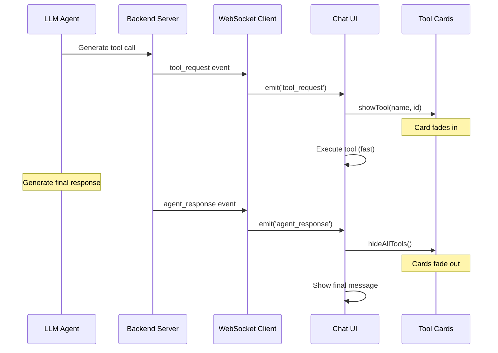

# Tool Activity Integration Investigation

## 🔍 Current WebSocket Flow Analysis

### Event Sequence
1. **Agent Processing**: LLM generates tool call response
2. **WebSocket Send**: Backend sends `tool_request` event via WebSocket 
3. **Frontend Receive**: `web/js/ws_client.js` receives message, emits `tool_request` event
4. **Extension Handler**: `web/js/extension.js` listens for `tool_request`, calls `toolExecutor.executeToolRequest()`
5. **Tool Execution**: `web/js/tool_executor.js` executes the tool (usually very fast)
6. **Agent Response**: Later, backend sends `agent_response` with final message
7. **UI Update**: `web/js/chat_ui.js` receives `agent_response`, calls `_handleAgentResponse()`, adds message to chat

### Key Files
- **`web/js/ws_client.js`**: WebSocket message routing (line 161: `case 'tool_request'`)
- **`web/js/extension.js`**: Tool request event handler (line 86: `wsClient.on('tool_request')`)
- **`web/js/chat_ui.js`**: Agent response handler (line 684: `_handleAgentResponse()`)
- **`web/js/tool_executor.js`**: 40+ tool implementations
- **`web/js/style.css`**: Currently minimal, only contains one image rule

### WebSocket Message Types
```javascript
// From ws_client.js handleMessage()
switch (message.type) {
    case 'handshake_ack':    // Connection established
    case 'agent_response':   // Final agent reply
    case 'tool_request':     // Tool execution request ⭐
    case 'typing_indicator': // Agent typing status
    case 'error':           // Error messages
}
```

---

## 🏗️ UI Structure Analysis

### ComfyUI Sidebar Integration
The chat UI operates within ComfyUI's native sidebar system:

```html
<!-- From chat_ui.js _initializeUI() -->
<div class="fl-chat-layout">
    <div class="fl-chat-header"><!-- Ren title + status --></div>
    <div class="fl-chat-messages"><!-- Message history --></div>
    <div class="fl-chat-typing"><!-- "Assistant is working..." --></div>
    <div class="fl-chat-input-container">   ⭐ TARGET AREA
        <textarea class="fl-chat-input">   ⭐ INPUT BOX
        <button class="fl-chat-send">
    </div>
</div>
```

### Container Hierarchy
- **Root**: `this.container` (passed to ChatUI constructor)
- **Layout**: `.fl-chat-layout` (flex column, full height)
- **Input Area**: `.fl-chat-input-container` (fixed at bottom)
- **Input Box**: `.fl-chat-input` (textarea with flex: 1)

### Styling System
- **CSS Location**: Injected via `_injectStyles()` method in chat_ui.js
- **Style File**: `web/js/style.css` (minimal, only image styles)
- **Theming**: Uses CSS custom properties for ComfyUI integration

---

## ⚡ Implementation Strategy

### Simplified Trigger Logic

```javascript
// Show card on tool_request
wsClient.on('tool_request', async (message) => {
    // Show tool activity card
    toolActivity.showTool(message.tool_name, message.request_id);
    
    // Execute tool (existing logic)
    await toolExecutor.executeToolRequest(message);
    // Note: Don't hide card here
});

// Hide card on agent_response (final message)
wsClient.on('agent_response', (message) => {
    // Hide all active tool cards
    toolActivity.hideAllTools();
    
    // Show message (existing logic)
    chatUI._handleAgentResponse(message);
});
```

### Card Positioning Strategy
**Target Location**: Above `.fl-chat-input-container`

```css
.fl-tool-activity-overlay {
    position: absolute;
    bottom: 100%; /* Above input container */
    left: 0;
    right: 0;
    pointer-events: none;
    z-index: 100;
    padding: 8px 16px 0 16px; /* Match input container padding */
}
```

### Integration Points

#### 1. ToolActivity Class
**File**: `web/js/tool_activity.js`
- Manages card lifecycle
- Handles multiple simultaneous tools
- Lightweight DOM manipulation

#### 2. ChatUI Integration
**File**: `web/js/chat_ui.js` modifications:
```javascript
// In constructor
import { ToolActivity } from './tool_activity.js';
this.toolActivity = new ToolActivity(this.container);

// In _initializeUI()
// Add tool activity overlay after input container
```

#### 3. Extension Event Handlers
**File**: `web/js/extension.js` modifications:
```javascript
// Access tool activity via global reference
const toolActivity = window.FL_JS.chatUI?.toolActivity;
```

---

## 🎯 Performance Considerations

### Lightweight Design Principles
- **No Progress Tracking**: No need for real progress data
- **Simple Show/Hide**: Binary visibility states
- **CSS Animations**: Hardware-accelerated transforms
- **Memory Efficient**: Cleanup completed cards immediately

### ComfyUI GPU Usage Compatibility
- **Non-blocking**: Tool cards don't interfere with generation
- **Minimal DOM**: Small footprint, simple animations
- **No polling**: Event-driven only
- **Efficient cleanup**: No memory leaks

### Edge Cases
- **Rapid tool succession**: Stack cards, max 3 visible
- **Missing agent_response**: Cleanup after timeout (30s)
- **WebSocket disconnect**: Clear all cards
- **Multiple sessions**: Isolated per session

---

## 🔧 Technical Implementation Details

### Tool Message Flow


### Timing Analysis
- **tool_request → execution**: ~1-50ms (frontend tools)
- **tool_request → agent_response**: ~500-5000ms (LLM processing)
- **Card display duration**: Full LLM response time
- **User perception**: "System is actively working"

### CSS Integration
All styles will be injected via the existing `_injectStyles()` method in `chat_ui.js` to maintain the current architecture.

### Global State Management
```javascript
// Extension makes ChatUI globally available
window.FL_JS = {
    chatUI: chatUIInstance,  // ⭐ Tool activity accessible here
    // ... other components
};
```

---

## 🚀 Simplified Implementation Plan

### Phase 1: Core Structure
1. Create `web/js/tool_activity.js` class
2. Add overlay container to chat UI layout
3. Basic show/hide functionality
4. Integration with `tool_request` event

### Phase 2: Visual Polish
1. Card design and animations
2. Tool message mapping
3. Stacking behavior for multiple tools
4. Fade in/out transitions

### Phase 3: Integration
1. Event handler modifications
2. Cleanup on `agent_response`
3. Error handling and edge cases
4. Testing with real workflows

---

## 📊 Expected Impact

### User Experience
- **Immediate Feedback**: Users see activity as soon as tool calls start
- **Reduced Anxiety**: Clear indication system is working
- **Ren's Personality**: Poetic tool descriptions enhance connection

### Technical
- **Zero Performance Impact**: No additional WebSocket calls or backend changes
- **Maintainable**: Clean separation of concerns
- **Compatible**: Works with existing ComfyUI GPU workflows

### Simple & Effective
This approach gives us 80% of the UX benefit with 20% of the complexity compared to real-time progress tracking or token streaming. Perfect for the "lightweight chat agent" requirement.
