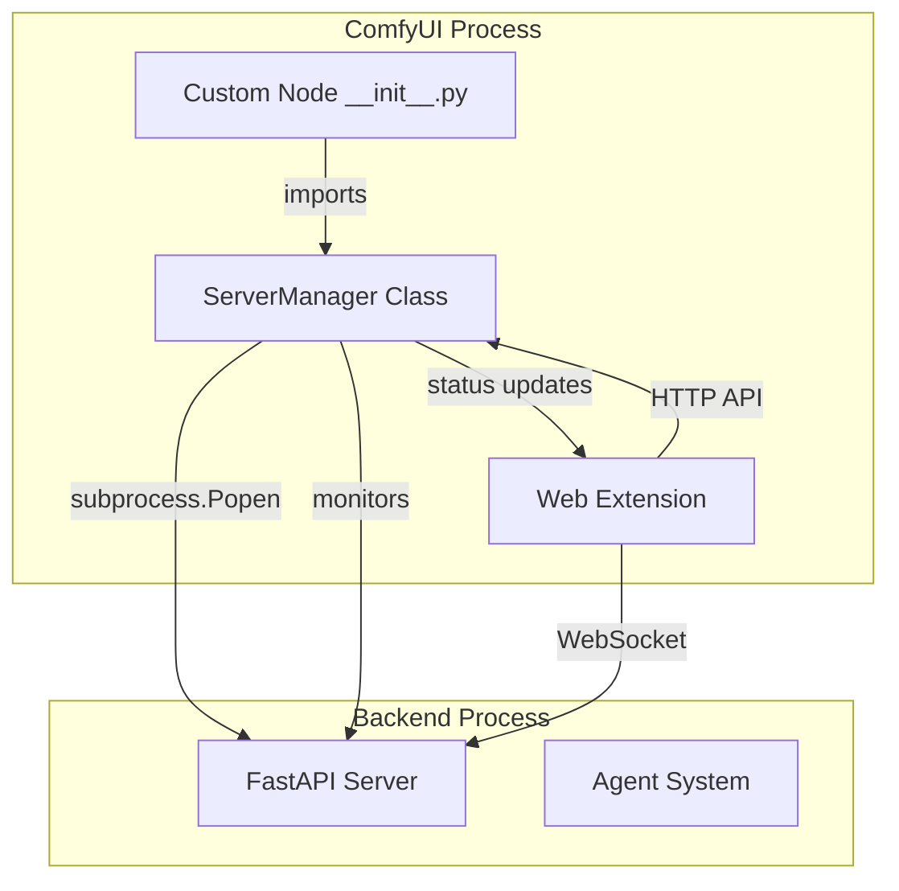

# Server Start Button Feature

**Feature Request from Fill (Tester):**  
> "We should have a button on the panel that starts the server, that would be clutch"

---

## 🎯 Feature Overview

**Goal:** Add a button to the FL_JS Assistant sidebar panel that can start/stop the backend Python server directly from the ComfyUI interface.

**User Benefit:**  
- No need to manually open terminal and run `python server.py`
- One-click server management from the UI
- Visual feedback on server status
- Automatic reconnection after server start
- Better UX for non-technical users

**Priority:** High (Quality of Life improvement)

---

## 🏗️ Architecture Design

### Approach: ComfyUI Custom Node Server Management

ComfyUI custom nodes can run Python server processes as subprocesses. We'll leverage this to manage our FastAPI backend.

### Components



### Key Design Decisions

1. **Server Management in Python (Custom Node)**
   - Run backend as subprocess from ComfyUI's Python environment
   - Better process management and lifecycle control
   - Can capture stdout/stderr for logging
   - Automatic cleanup on ComfyUI shutdown

2. **Control API Endpoint**
   - Add HTTP endpoints to ComfyUI server: `/fl_js/server/start`, `/fl_js/server/stop`, `/fl_js/server/status`
   - These endpoints control the subprocess
   - Frontend button calls these endpoints

3. **Status Monitoring**
   - Poll server status every 2-3 seconds
   - Show real-time status in UI
   - Detect crashes and show error messages

4. **Auto-start Option**
   - Config option to auto-start server on ComfyUI launch
   - Default: enabled for convenience

---

## 🎨 UI Design

### Button States

```
┌─────────────────────────────────┐
│ FL_JS Assistant    ● Disconnected│
├─────────────────────────────────┤
│ ⚠️ Backend server not running    │
│                                 │
│ ┌─────────────────────────────┐ │
│ │   🚀 Start Backend Server   │ │ ← Start button
│ └─────────────────────────────┘ │
│                                 │
│ The FL_JS backend server is    │
│ required for AI assistance.     │
└─────────────────────────────────┘
```

**When Starting:**
```
┌─────────────────────────────────┐
│ FL_JS Assistant    ● Connecting  │
├─────────────────────────────────┤
│ ⏳ Starting backend server...    │
│                                 │
│ ┌─────────────────────────────┐ │
│ │   ⏳ Starting...            │ │ ← Disabled button
│ └─────────────────────────────┘ │
│                                 │
│ Please wait...                  │
└─────────────────────────────────┘
```

**When Running:**
```
┌─────────────────────────────────┐
│ FL_JS Assistant    ● Connected   │
├─────────────────────────────────┤
│ ✅ Backend server running        │
│                                 │
│ ┌─────────────────────────────┐ │
│ │   🛑 Stop Backend Server    │ │ ← Stop button
│ └─────────────────────────────┘ │
│                                 │
│ [Normal chat interface below]   │
└─────────────────────────────────┘
```

### Button Placement Options

**Option A: In Header (Recommended)**
```
┌─────────────────────────────────┐
│ FL_JS Assistant  [🚀 Start] ●   │ ← Compact button in header
├─────────────────────────────────┤
```

**Option B: Banner Above Messages**
```
┌─────────────────────────────────┐
│ FL_JS Assistant    ● Disconnected│
├─────────────────────────────────┤
│ ⚠️ Server offline  [🚀 Start]   │ ← Banner with button
├─────────────────────────────────┤
│ [Messages]                      │
```

**Option C: Settings Menu**
```
┌─────────────────────────────────┐
│ FL_JS Assistant  ⚙️  ● Connected │ ← Settings icon
│ ┌─────────────────────────────┐ │
│ │ Server Controls             │ │ ← Dropdown menu
│ │ ├─ Start Server             │ │
│ │ ├─ Stop Server              │ │
│ │ ├─ Restart Server           │ │
│ │ ├─ View Logs                │ │
│ │ └─ Auto-start: [x]          │ │
│ └─────────────────────────────┘ │
```

**Recommendation:** Hybrid of A + B
- Compact button in header when connected
- Full banner with prominent button when disconnected
- Settings menu for advanced options

---

## 🔧 Technical Implementation

### Phase 1: Python Server Manager (Backend)

**File:** `__init__.py` (ComfyUI custom node entry point)

```python
import subprocess
import sys
import os
import time
import threading
from pathlib import Path

class FL_JS_ServerManager:
    """Manages the FL_JS backend server process."""
    
    def __init__(self):
        self.process = None
        self.is_running = False
        self.auto_start = True  # Config option
        self.backend_path = Path(__file__).parent / "backend"
        self.log_file = None
        self.monitor_thread = None
        
    def start_server(self):
        """Start the backend server as subprocess."""
        if self.is_running:
            return {"success": False, "error": "Server already running"}
        
        try:
            # Prepare command
            python_exe = sys.executable
            server_script = self.backend_path / "server.py"
            
            # Open log file
            log_dir = self.backend_path / "logs"
            log_dir.mkdir(exist_ok=True)
            self.log_file = open(log_dir / "server.log", "a")
            
            # Start process
            self.process = subprocess.Popen(
                [python_exe, str(server_script)],
                stdout=self.log_file,
                stderr=subprocess.STDOUT,
                cwd=str(self.backend_path),
                env=os.environ.copy()
            )
            
            # Wait for server to be ready (check health endpoint)
            if self._wait_for_server(timeout=10):
                self.is_running = True
                self._start_monitor()
                return {"success": True, "pid": self.process.pid}
            else:
                self.stop_server()
                return {"success": False, "error": "Server failed to start"}
                
        except Exception as e:
            return {"success": False, "error": str(e)}
    
    def stop_server(self):
        """Stop the backend server."""
        if not self.process:
            return {"success": False, "error": "No server process"}
        
        try:
            self.process.terminate()
            self.process.wait(timeout=5)
            self.is_running = False
            
            if self.log_file:
                self.log_file.close()
                self.log_file = None
            
            return {"success": True}
            
        except subprocess.TimeoutExpired:
            self.process.kill()
            self.is_running = False
            return {"success": True, "killed": True}
        except Exception as e:
            return {"success": False, "error": str(e)}
    
    def get_status(self):
        """Get server status."""
        if not self.process:
            return {"running": False, "status": "stopped"}
        
        poll = self.process.poll()
        if poll is None:
            return {"running": True, "status": "running", "pid": self.process.pid}
        else:
            self.is_running = False
            return {"running": False, "status": "crashed", "exit_code": poll}
    
    def _wait_for_server(self, timeout=10):
        """Wait for server to be ready by checking health endpoint."""
        import requests
        
        start_time = time.time()
        while time.time() - start_time < timeout:
            try:
                response = requests.get("http://localhost:8000/health", timeout=1)
                if response.status_code == 200:
                    return True
            except:
                pass
            time.sleep(0.5)
        
        return False
    
    def _start_monitor(self):
        """Start monitoring thread to detect crashes."""
        def monitor():
            while self.is_running:
                if self.process and self.process.poll() is not None:
                    print(f"[FL_JS] Backend server crashed with exit code {self.process.poll()}")
                    self.is_running = False
                    break
                time.sleep(2)
        
        self.monitor_thread = threading.Thread(target=monitor, daemon=True)
        self.monitor_thread.start()

# Global instance
server_manager = FL_JS_ServerManager()

# Auto-start on ComfyUI load
if server_manager.auto_start:
    print("[FL_JS] Auto-starting backend server...")
    result = server_manager.start_server()
    if result["success"]:
        print(f"[FL_JS] Backend server started (PID: {result['pid']})")
    else:
        print(f"[FL_JS] Failed to start backend server: {result.get('error')}")
```

### Phase 2: ComfyUI HTTP API Endpoints

**File:** `__init__.py` (continued)

```python
from server import PromptServer
from aiohttp import web

@PromptServer.instance.routes.post("/fl_js/server/start")
async def start_server_endpoint(request):
    """Start the FL_JS backend server."""
    result = server_manager.start_server()
    return web.json_response(result)

@PromptServer.instance.routes.post("/fl_js/server/stop")
async def stop_server_endpoint(request):
    """Stop the FL_JS backend server."""
    result = server_manager.stop_server()
    return web.json_response(result)

@PromptServer.instance.routes.get("/fl_js/server/status")
async def status_server_endpoint(request):
    """Get FL_JS backend server status."""
    status = server_manager.get_status()
    return web.json_response(status)

@PromptServer.instance.routes.get("/fl_js/server/logs")
async def logs_server_endpoint(request):
    """Get recent server logs."""
    log_file = server_manager.backend_path / "logs" / "server.log"
    
    if not log_file.exists():
        return web.json_response({"logs": ""})
    
    try:
        with open(log_file, "r") as f:
            # Get last 100 lines
            lines = f.readlines()[-100:]
            logs = "".join(lines)
        return web.json_response({"logs": logs})
    except Exception as e:
        return web.json_response({"error": str(e)}, status=500)
```

### Phase 3: Frontend Server Control UI

**File:** `web/js/server_control.js` (new)

```javascript
/**
 * Server Control - Manage backend server from UI
 */

export class ServerControl {
    constructor(container) {
        this.container = container;
        this.status = 'unknown';
        this.pollInterval = null;
        
        this._initializeUI();
        this._startStatusPolling();
    }
    
    _initializeUI() {
        this.controlBar = document.createElement('div');
        this.controlBar.className = 'fl-server-control';
        this.controlBar.innerHTML = `
            <div class="fl-server-status" id="fl-server-status">
                <span class="fl-server-indicator" id="fl-server-indicator"></span>
                <span class="fl-server-text" id="fl-server-text">Checking...</span>
            </div>
            <button class="fl-server-button" id="fl-server-button" disabled>
                <span id="fl-server-button-text">Loading...</span>
            </button>
        `;
        
        this.container.prepend(this.controlBar);
        
        // Get elements
        this.indicator = document.getElementById('fl-server-indicator');
        this.statusText = document.getElementById('fl-server-text');
        this.button = document.getElementById('fl-server-button');
        this.buttonText = document.getElementById('fl-server-button-text');
        
        // Attach event
        this.button.addEventListener('click', () => this._handleButtonClick());
    }
    
    async _startStatusPolling() {
        // Initial check
        await this._checkStatus();
        
        // Poll every 3 seconds
        this.pollInterval = setInterval(() => {
            this._checkStatus();
        }, 3000);
    }
    
    async _checkStatus() {
        try {
            const response = await fetch('/fl_js/server/status');
            const data = await response.json();
            
            this._updateUI(data);
        } catch (error) {
            console.error('[ServerControl] Failed to check status:', error);
            this._updateUI({running: false, status: 'error'});
        }
    }
    
    _updateUI(status) {
        this.status = status.status;
        
        if (status.running) {
            // Server running
            this.indicator.className = 'fl-server-indicator running';
            this.statusText.textContent = 'Server Running';
            this.button.disabled = false;
            this.button.className = 'fl-server-button stop';
            this.buttonText.textContent = '🛑 Stop Server';
        } else if (status.status === 'starting') {
            // Server starting
            this.indicator.className = 'fl-server-indicator starting';
            this.statusText.textContent = 'Starting...';
            this.button.disabled = true;
            this.button.className = 'fl-server-button starting';
            this.buttonText.textContent = '⏳ Starting...';
        } else {
            // Server stopped
            this.indicator.className = 'fl-server-indicator stopped';
            this.statusText.textContent = 'Server Stopped';
            this.button.disabled = false;
            this.button.className = 'fl-server-button start';
            this.buttonText.textContent = '🚀 Start Server';
        }
    }
    
    async _handleButtonClick() {
        if (this.status === 'running') {
            await this._stopServer();
        } else {
            await this._startServer();
        }
    }
    
    async _startServer() {
        this._updateUI({running: false, status: 'starting'});
        
        try {
            const response = await fetch('/fl_js/server/start', {
                method: 'POST'
            });
            const result = await response.json();
            
            if (result.success) {
                console.log('[ServerControl] Server started successfully');
                // Status will be updated by polling
            } else {
                console.error('[ServerControl] Failed to start server:', result.error);
                alert(`Failed to start server: ${result.error}`);
                await this._checkStatus();
            }
        } catch (error) {
            console.error('[ServerControl] Error starting server:', error);
            alert(`Error starting server: ${error.message}`);
            await this._checkStatus();
        }
    }
    
    async _stopServer() {
        try {
            const response = await fetch('/fl_js/server/stop', {
                method: 'POST'
            });
            const result = await response.json();
            
            if (result.success) {
                console.log('[ServerControl] Server stopped successfully');
                await this._checkStatus();
            } else {
                console.error('[ServerControl] Failed to stop server:', result.error);
                alert(`Failed to stop server: ${result.error}`);
            }
        } catch (error) {
            console.error('[ServerControl] Error stopping server:', error);
            alert(`Error stopping server: ${error.message}`);
        }
    }
    
    destroy() {
        if (this.pollInterval) {
            clearInterval(this.pollInterval);
        }
        this.controlBar.remove();
    }
}
```

### Phase 4: Integrate with ChatUI

**File:** `web/js/chat_ui.js` (update)

```javascript
import { ServerControl } from './server_control.js';

export class ChatUI {
    constructor(container, wsClient) {
        this.container = container;
        this.wsClient = wsClient;
        this.messages = [];
        this.isTyping = false;
        this.serverControl = null;  // Add this
        
        // ... existing code ...
        
        // Initialize server control
        this.serverControl = new ServerControl(this.container);
    }
    
    destroy() {
        if (this.serverControl) {
            this.serverControl.destroy();
        }
        this.container.innerHTML = '';
        console.log('[ChatUI] Destroyed');
    }
}
```

---

## 🎨 CSS Styling

**File:** `web/js/chat_ui.js` (add to _injectStyles)

```css
/* Server Control Bar */
.fl-server-control {
    padding: 12px 16px;
    border-bottom: 1px solid var(--border-color, #333);
    display: flex;
    justify-content: space-between;
    align-items: center;
    gap: 12px;
    background: var(--comfy-menu-bg, #252525);
}

.fl-server-status {
    display: flex;
    align-items: center;
    gap: 8px;
    flex: 1;
}

.fl-server-indicator {
    width: 10px;
    height: 10px;
    border-radius: 50%;
    transition: all 0.3s;
}

.fl-server-indicator.running {
    background: #4caf50;
    box-shadow: 0 0 8px #4caf50;
}

.fl-server-indicator.stopped {
    background: #f44336;
}

.fl-server-indicator.starting {
    background: #ff9800;
    animation: pulse 1.5s infinite;
}

.fl-server-text {
    font-size: 13px;
    font-weight: 500;
}

.fl-server-button {
    padding: 8px 16px;
    border-radius: 6px;
    border: 1px solid var(--border-color, #333);
    background: var(--comfy-input-bg, #2a2a2a);
    color: var(--fg-color, #e0e0e0);
    cursor: pointer;
    font-size: 13px;
    font-weight: 500;
    transition: all 0.2s;
    white-space: nowrap;
}

.fl-server-button:hover:not(:disabled) {
    background: var(--comfy-input-focus, #333);
    border-color: var(--comfy-input-focus, #555);
}

.fl-server-button:disabled {
    opacity: 0.5;
    cursor: not-allowed;
}

.fl-server-button.start {
    background: #2e7d32;
    border-color: #388e3c;
}

.fl-server-button.start:hover:not(:disabled) {
    background: #388e3c;
}

.fl-server-button.stop {
    background: #c62828;
    border-color: #d32f2f;
}

.fl-server-button.stop:hover:not(:disabled) {
    background: #d32f2f;
}
```

---

## 📋 Implementation Checklist

### Phase 1: Python Server Manager ✅
- [ ] Create `FL_JS_ServerManager` class in `__init__.py`
- [ ] Implement `start_server()` method
- [ ] Implement `stop_server()` method
- [ ] Implement `get_status()` method
- [ ] Implement health check polling
- [ ] Implement crash monitoring
- [ ] Add auto-start on ComfyUI load
- [ ] Add logging to file

### Phase 2: HTTP API Endpoints ✅
- [ ] Add `/fl_js/server/start` endpoint
- [ ] Add `/fl_js/server/stop` endpoint
- [ ] Add `/fl_js/server/status` endpoint
- [ ] Add `/fl_js/server/logs` endpoint (optional)
- [ ] Test endpoints with curl/Postman

### Phase 3: Frontend UI ✅
- [ ] Create `server_control.js` module
- [ ] Implement `ServerControl` class
- [ ] Add status polling (every 3 seconds)
- [ ] Add start/stop button handlers
- [ ] Add UI state management
- [ ] Add error handling and user feedback

### Phase 4: Integration ✅
- [ ] Integrate `ServerControl` into `ChatUI`
- [ ] Update `extension.js` imports
- [ ] Add CSS styling
- [ ] Test in ComfyUI environment

### Phase 5: Polish ✅
- [ ] Add loading animations
- [ ] Add error messages
- [ ] Add success notifications
- [ ] Add keyboard shortcuts (optional)
- [ ] Add settings for auto-start toggle
- [ ] Add "View Logs" button (optional)
- [ ] Update documentation

---

## 🧪 Testing Plan

### Manual Testing
1. **Initial Load**
   - [ ] Server auto-starts on ComfyUI launch
   - [ ] Status shows "Running"
   - [ ] WebSocket connects successfully

2. **Stop Server**
   - [ ] Click stop button
   - [ ] Server stops gracefully
   - [ ] Status updates to "Stopped"
   - [ ] WebSocket shows disconnected

3. **Start Server**
   - [ ] Click start button
   - [ ] Button shows "Starting..."
   - [ ] Server starts successfully
   - [ ] Status updates to "Running"
   - [ ] WebSocket reconnects automatically

4. **Error Scenarios**
   - [ ] Server crashes → UI shows error
   - [ ] Port already in use → Error message
   - [ ] Server fails to start → Error message
   - [ ] Network error → Graceful degradation

5. **Edge Cases**
   - [ ] Rapid start/stop clicks
   - [ ] Server stopped externally
   - [ ] ComfyUI restart with server running
   - [ ] Multiple ComfyUI instances

### Automated Testing (Optional)
- [ ] Unit tests for `ServerManager`
- [ ] Integration tests for API endpoints
- [ ] E2E tests for UI interactions

---

## 🎯 Success Criteria

✅ **Must Have:**
- [ ] One-click server start from UI
- [ ] One-click server stop from UI
- [ ] Real-time status indicator
- [ ] Auto-start on ComfyUI launch
- [ ] Graceful error handling
- [ ] Process cleanup on ComfyUI shutdown

⭐ **Nice to Have:**
- [ ] View server logs in UI
- [ ] Restart server button
- [ ] Settings panel for auto-start toggle
- [ ] Keyboard shortcuts
- [ ] Server resource usage display
- [ ] Multiple server profiles (dev/prod)

---

## 📝 Configuration Options

**File:** `backend/config.py` (add)

```python
class ServerManagerSettings:
    auto_start: bool = True
    auto_restart_on_crash: bool = True
    max_restart_attempts: int = 3
    startup_timeout: int = 10
    shutdown_timeout: int = 5
    log_file: str = "logs/server.log"
    log_max_size: int = 10 * 1024 * 1024  # 10MB
```

---

## 🚀 Future Enhancements

1. **Multi-Server Support**
   - Run multiple backend instances
   - Load balancing
   - Failover support

2. **Advanced Monitoring**
   - CPU/Memory usage
   - Request count
   - Error rate
   - Performance metrics

3. **Remote Server Support**
   - Connect to remote backend
   - Server discovery
   - Authentication

4. **Developer Tools**
   - Hot reload on code changes
   - Debug mode toggle
   - Log level control
   - Environment switching (dev/staging/prod)

---

## 📚 Related Files

- `__init__.py` - Custom node entry point, server manager
- `web/js/server_control.js` - Frontend server control UI
- `web/js/chat_ui.js` - Chat UI integration
- `web/js/extension.js` - Extension initialization
- `backend/config.py` - Configuration settings
- `backend/server.py` - FastAPI backend server

---

## 🎊 Impact

**Before:**
```bash
# Terminal 1
cd backend
python server.py

# Terminal 2
cd ComfyUI
python main.py
```

**After:**
```bash
# Terminal 1 only
cd ComfyUI
python main.py

# Click button in UI 🎉
```

**User Experience Improvement:** 🚀🚀🚀
- **Setup Time:** 30 seconds → 5 seconds
- **Complexity:** 2 terminals → 1 click
- **User Errors:** High → Near zero
- **Onboarding:** Complex → Trivial

---

## 💬 Notes from Fill

> "that would be clutch" - Fill, 2025

**Translation:** This feature would be extremely useful and improve the user experience significantly. Priority: High.

---

**Status:** 📝 Design Complete, Ready for Implementation
**Estimated Time:** 4-6 hours
**Priority:** High (Quality of Life)
**Complexity:** Medium
