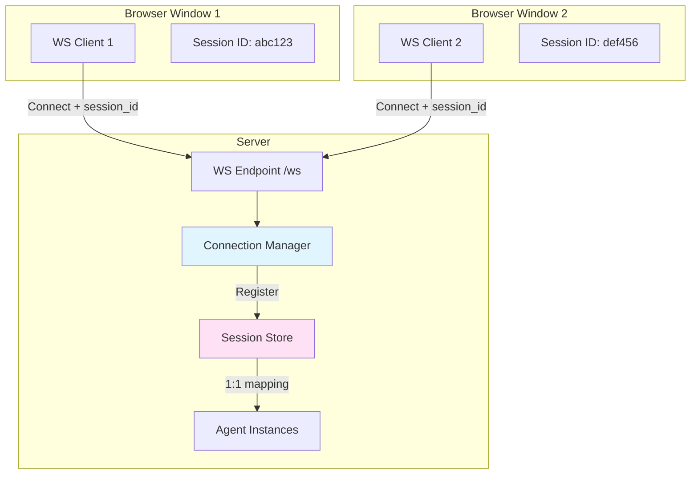
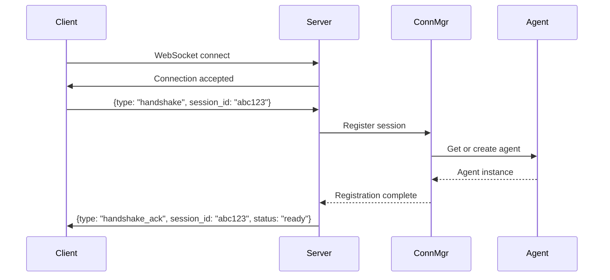

# WebSocket Protocol Implementation Plan

## Multi-Client Connection Strategy

### Requirements
- Single WebSocket endpoint on server
- Multiple ComfyUI browser windows can connect simultaneously
- Each connection must be isolated (no message mixing)
- Session management for context continuity
- Graceful handling of disconnections and reconnections

### Connection Architecture



## Session Management

### Session Lifecycle

1. **Client Initialization**
   - Client generates unique session_id (UUID) on first load
   - Stores session_id in browser localStorage
   - Sends session_id in first WebSocket message (handshake)

2. **Server Registration**
   - Server receives connection with session_id
   - Creates or retrieves session from session store
   - Maps WebSocket connection to session
   - Initializes or retrieves PydanticAI agent for session

3. **Message Routing**
   - All messages include session_id
   - Server routes messages to correct agent instance
   - Agent maintains conversation context per session

4. **Disconnection Handling**
   - Server detects WebSocket close
   - Keeps session data alive for reconnection window (e.g., 5 minutes)
   - Client attempts reconnection with same session_id
   - Session context restored on reconnection

5. **Session Cleanup**
   - After timeout period, session is marked for cleanup
   - Agent context saved (optional persistence)
   - Session removed from active store

### Implementation Details

```python
# backend/websocket.py

from fastapi import WebSocket, WebSocketDisconnect
from typing import Dict
import uuid
from datetime import datetime, timedelta

class ConnectionManager:
    def __init__(self):
        # Map session_id -> WebSocket connection
        self.active_connections: Dict[str, WebSocket] = {}
        # Map session_id -> Agent instance
        self.session_agents: Dict[str, Agent] = {}
        # Map session_id -> last activity timestamp
        self.session_activity: Dict[str, datetime] = {}
        # Session timeout (5 minutes)
        self.session_timeout = timedelta(minutes=5)
    
    async def connect(self, websocket: WebSocket, session_id: str):
        await websocket.accept()
        self.active_connections[session_id] = websocket
        self.session_activity[session_id] = datetime.now()
        
        # Create or retrieve agent for this session
        if session_id not in self.session_agents:
            self.session_agents[session_id] = create_agent(session_id)
        
        return self.session_agents[session_id]
    
    def disconnect(self, session_id: str):
        if session_id in self.active_connections:
            del self.active_connections[session_id]
        # Keep session_agents and session_activity for reconnection
    
    async def send_message(self, session_id: str, message: dict):
        if session_id in self.active_connections:
            websocket = self.active_connections[session_id]
            await websocket.send_json(message)
    
    def cleanup_stale_sessions(self):
        now = datetime.now()
        stale_sessions = [
            sid for sid, last_activity in self.session_activity.items()
            if now - last_activity > self.session_timeout
            and sid not in self.active_connections  # Only cleanup disconnected sessions
        ]
        for sid in stale_sessions:
            if sid in self.session_agents:
                del self.session_agents[sid]
            if sid in self.session_activity:
                del self.session_activity[sid]

manager = ConnectionManager()
```

## Message Protocol

### Handshake Flow



### Message Format

All messages MUST include `session_id` for routing:

```typescript
// Base message structure
interface BaseMessage {
    session_id: string;  // Required for all messages
    type: string;        // Message type
    timestamp?: string;  // ISO timestamp
}

// Client -> Server messages
interface UserMessage extends BaseMessage {
    type: "user_message";
    content: string;
}

interface ToolResult extends BaseMessage {
    type: "tool_result";
    request_id: string;
    success: boolean;
    data?: any;
    error?: string;
    execution_time_ms: number;
}

interface Handshake extends BaseMessage {
    type: "handshake";
    client_version?: string;
}

interface Ping extends BaseMessage {
    type: "ping";
}

// Server -> Client messages
interface HandshakeAck extends BaseMessage {
    type: "handshake_ack";
    status: "ready" | "reconnected";
    agent_context?: any;
}

interface AgentResponse extends BaseMessage {
    type: "agent_response";
    content: string;
    is_final: boolean;
}

interface ToolRequest extends BaseMessage {
    type: "tool_request";
    request_id: string;
    tool_name: string;
    parameters: Record<string, any>;
    timeout_ms: number;
}

interface TypingIndicator extends BaseMessage {
    type: "typing_indicator";
    is_typing: boolean;
}

interface ErrorMessage extends BaseMessage {
    type: "error";
    error_code: string;
    message: string;
    details?: any;
}

interface Pong extends BaseMessage {
    type: "pong";
}
```

## Connection Resilience

### Heartbeat Mechanism

```javascript
// frontend/ws_client.js

class WSClient {
    constructor(sessionId) {
        this.sessionId = sessionId;
        this.ws = null;
        this.heartbeatInterval = null;
        this.reconnectAttempts = 0;
        this.maxReconnectAttempts = 5;
        this.reconnectDelay = 1000; // Start with 1 second
    }
    
    connect() {
        this.ws = new WebSocket('ws://localhost:8000/ws');
        
        this.ws.onopen = () => {
            console.log('WebSocket connected');
            this.reconnectAttempts = 0;
            this.reconnectDelay = 1000;
            this.sendHandshake();
            this.startHeartbeat();
        };
        
        this.ws.onclose = () => {
            console.log('WebSocket disconnected');
            this.stopHeartbeat();
            this.attemptReconnect();
        };
        
        this.ws.onerror = (error) => {
            console.error('WebSocket error:', error);
        };
        
        this.ws.onmessage = (event) => {
            const message = JSON.parse(event.data);
            this.handleMessage(message);
        };
    }
    
    sendHandshake() {
        this.send({
            type: 'handshake',
            session_id: this.sessionId,
            client_version: '1.0.0'
        });
    }
    
    startHeartbeat() {
        this.heartbeatInterval = setInterval(() => {
            if (this.ws.readyState === WebSocket.OPEN) {
                this.send({ type: 'ping', session_id: this.sessionId });
            }
        }, 30000); // Every 30 seconds
    }
    
    stopHeartbeat() {
        if (this.heartbeatInterval) {
            clearInterval(this.heartbeatInterval);
            this.heartbeatInterval = null;
        }
    }
    
    attemptReconnect() {
        if (this.reconnectAttempts >= this.maxReconnectAttempts) {
            console.error('Max reconnection attempts reached');
            this.onMaxReconnectReached?.();
            return;
        }
        
        this.reconnectAttempts++;
        console.log(`Reconnecting... (attempt ${this.reconnectAttempts})`);
        
        setTimeout(() => {
            this.connect();
        }, this.reconnectDelay);
        
        // Exponential backoff
        this.reconnectDelay = Math.min(this.reconnectDelay * 2, 30000);
    }
    
    send(message) {
        if (this.ws.readyState === WebSocket.OPEN) {
            this.ws.send(JSON.stringify(message));
        } else {
            console.warn('WebSocket not open, queueing message');
            this.messageQueue.push(message);
        }
    }
}
```

### Server Heartbeat Handler

```python
# backend/websocket.py

async def handle_ping(websocket: WebSocket, session_id: str):
    await manager.send_message(session_id, {
        "type": "pong",
        "session_id": session_id,
        "timestamp": datetime.now().isoformat()
    })
    # Update session activity
    manager.session_activity[session_id] = datetime.now()
```

## FastAPI WebSocket Endpoint

```python
# backend/server.py

from fastapi import FastAPI, WebSocket, WebSocketDisconnect
from fastapi.middleware.cors import CORSMiddleware
import asyncio

app = FastAPI()

# CORS for local development
app.add_middleware(
    CORSMiddleware,
    allow_origins=["*"],  # Configure appropriately for production
    allow_credentials=True,
    allow_methods=["*"],
    allow_headers=["*"],
)

@app.websocket("/ws")
async def websocket_endpoint(websocket: WebSocket):
    session_id = None
    agent = None
    
    try:
        # Wait for handshake to get session_id
        await websocket.accept()
        
        # First message should be handshake
        handshake_data = await websocket.receive_json()
        
        if handshake_data.get("type") != "handshake":
            await websocket.send_json({
                "type": "error",
                "error_code": "INVALID_HANDSHAKE",
                "message": "First message must be handshake"
            })
            await websocket.close()
            return
        
        session_id = handshake_data.get("session_id")
        if not session_id:
            await websocket.send_json({
                "type": "error",
                "error_code": "MISSING_SESSION_ID",
                "message": "session_id is required"
            })
            await websocket.close()
            return
        
        # Register connection and get agent
        agent = await manager.connect(websocket, session_id)
        
        # Send handshake acknowledgment
        is_reconnect = session_id in manager.session_activity
        await manager.send_message(session_id, {
            "type": "handshake_ack",
            "session_id": session_id,
            "status": "reconnected" if is_reconnect else "ready"
        })
        
        # Message loop
        while True:
            data = await websocket.receive_json()
            
            # Validate session_id
            if data.get("session_id") != session_id:
                await manager.send_message(session_id, {
                    "type": "error",
                    "session_id": session_id,
                    "error_code": "SESSION_MISMATCH",
                    "message": "Message session_id does not match connection"
                })
                continue
            
            # Route message based on type
            msg_type = data.get("type")
            
            if msg_type == "ping":
                await handle_ping(websocket, session_id)
            
            elif msg_type == "user_message":
                await handle_user_message(websocket, session_id, agent, data)
            
            elif msg_type == "tool_result":
                await handle_tool_result(websocket, session_id, agent, data)
            
            else:
                await manager.send_message(session_id, {
                    "type": "error",
                    "session_id": session_id,
                    "error_code": "UNKNOWN_MESSAGE_TYPE",
                    "message": f"Unknown message type: {msg_type}"
                })
    
    except WebSocketDisconnect:
        if session_id:
            manager.disconnect(session_id)
            print(f"Client {session_id} disconnected")
    
    except Exception as e:
        print(f"Error in WebSocket connection: {e}")
        if session_id:
            manager.disconnect(session_id)
        await websocket.close()

# Background task to cleanup stale sessions
@app.on_event("startup")
async def startup_event():
    async def cleanup_task():
        while True:
            await asyncio.sleep(60)  # Every minute
            manager.cleanup_stale_sessions()
    
    asyncio.create_task(cleanup_task())
```

## Client Session Initialization

```javascript
// frontend/session_manager.js

class SessionManager {
    constructor() {
        this.sessionId = this.getOrCreateSessionId();
    }
    
    getOrCreateSessionId() {
        const STORAGE_KEY = 'fl_js_session_id';
        let sessionId = localStorage.getItem(STORAGE_KEY);
        
        if (!sessionId) {
            sessionId = this.generateUUID();
            localStorage.setItem(STORAGE_KEY, sessionId);
        }
        
        return sessionId;
    }
    
    generateUUID() {
        return 'xxxxxxxx-xxxx-4xxx-yxxx-xxxxxxxxxxxx'.replace(/[xy]/g, function(c) {
            const r = Math.random() * 16 | 0;
            const v = c === 'x' ? r : (r & 0x3 | 0x8);
            return v.toString(16);
        });
    }
    
    clearSession() {
        localStorage.removeItem('fl_js_session_id');
        this.sessionId = this.generateUUID();
    }
}
```

## Testing Strategy

### Multi-Client Test Scenarios

1. **Simultaneous Connections**
   - Open 3 browser windows
   - Each should get unique session
   - Messages should route correctly
   - No cross-contamination

2. **Reconnection Test**
   - Establish connection
   - Close browser tab
   - Reopen within timeout window
   - Context should be preserved

3. **Session Timeout Test**
   - Establish connection
   - Disconnect for > 5 minutes
   - Reconnect
   - Should get new session context

4. **Concurrent Tool Execution**
   - Two clients execute tools simultaneously
   - Results should route to correct client
   - No result mixing

5. **Server Restart**
   - Clients connected
   - Server restarts
   - Clients should auto-reconnect
   - Sessions recreated

## Security Considerations

1. **Session Validation**
   - Validate session_id format (UUID)
   - Rate limit connections per IP
   - Session hijacking prevention

2. **Message Validation**
   - Validate all message schemas with Pydantic
   - Sanitize user input
   - Prevent injection attacks

3. **Resource Limits**
   - Max sessions per IP
   - Max message size
   - Max tool execution time
   - Memory limits per session

## Configuration

```python
# backend/config.py

from pydantic_settings import BaseSettings

class Settings(BaseSettings):
    # WebSocket settings
    ws_heartbeat_interval: int = 30  # seconds
    ws_session_timeout: int = 300  # seconds (5 minutes)
    ws_max_reconnect_attempts: int = 5
    
    # Connection limits
    max_connections_per_ip: int = 10
    max_message_size: int = 1_000_000  # 1MB
    
    # Tool execution
    tool_timeout: int = 30000  # milliseconds
    max_tool_retries: int = 3
    
    class Config:
        env_file = ".env"

settings = Settings()
```

## Summary

✅ **Single WebSocket endpoint** at `/ws`
✅ **Multi-client support** via session_id routing
✅ **Session persistence** with configurable timeout
✅ **Automatic reconnection** with exponential backoff
✅ **Heartbeat monitoring** for connection health
✅ **Message isolation** per session
✅ **Agent instance per session** for context continuity
✅ **Graceful cleanup** of stale sessions
