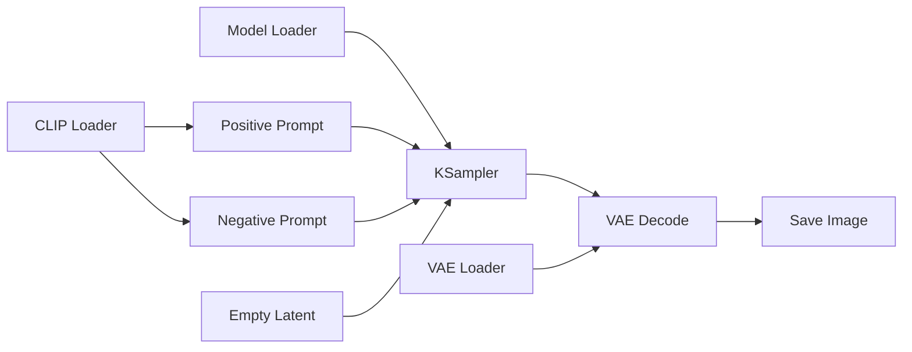
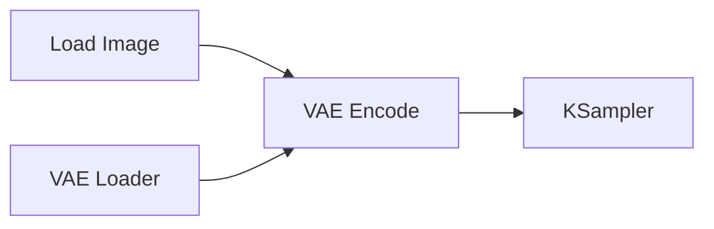
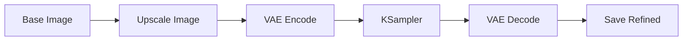
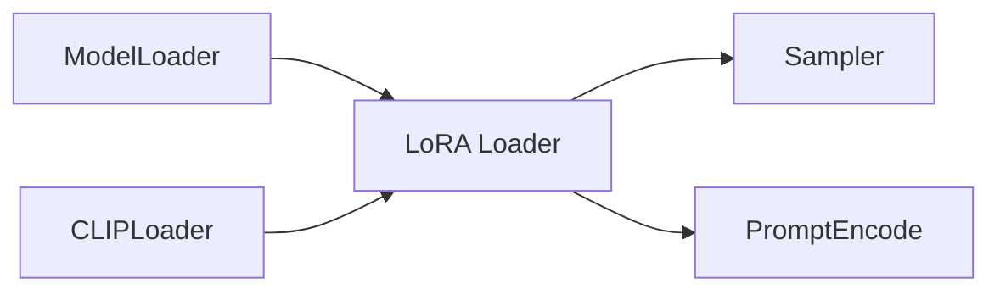
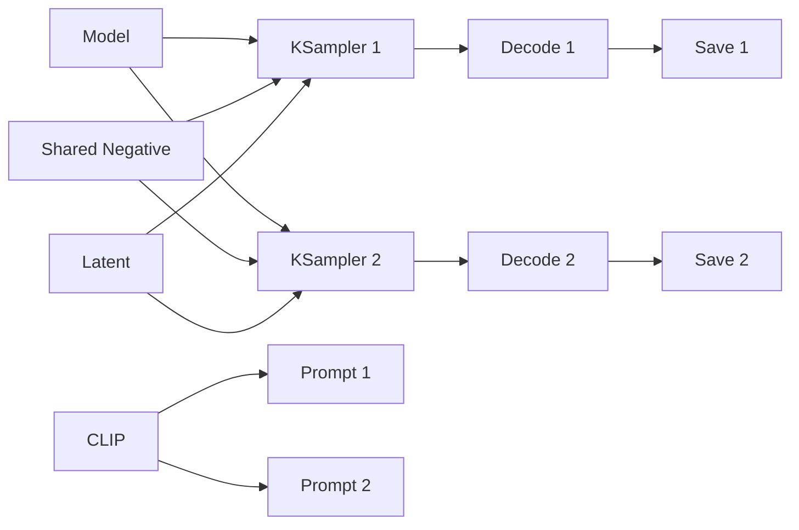

# Comfy Workflow Patterns

Use these patterns as defaults when creating or repairing ComfyUI workflows. Adapt to the installed node types and the model family already in the graph.

## Common Slot Types

- `MODEL` -> sampler `model`
- `CLIP` -> text encode `clip`
- `CONDITIONING` -> sampler `positive` or `negative`
- `LATENT` -> sampler `latent_image` or decoder `samples`
- `VAE` -> encoder/decoder `vae`
- `IMAGE` -> image processors, previews, or save nodes
- `MASK` -> mask processors, inpaint conditioning, or composite nodes

## Basic Text-to-Image

Defaults:

- Use separate positive and negative prompt nodes unless the user requests identical conditioning.
- Keep one shared loader set for one model family.
- Typical KSampler ranges depend on model family; inspect the current workflow before changing them.

## Image-to-Image

Replace `EmptyLatentImage` with:

Use denoise below `1.0` when preserving source composition. Higher denoise changes more of the image.

## Upscale or Refine

Keep the first pass and refine pass visually grouped. Name save prefixes so outputs can be compared.

## LoRA Insertion

Typical placement:

Do not add a LoRA blindly. Confirm model family compatibility and the target loader path first.

## Multi-Prompt Branching

Use shared model, CLIP, VAE, and latent settings when comparing prompt variations:

Use fixed seeds for controlled prompt comparisons and random seeds for exploratory batches.

## Debugging Probe Pattern

Use temporary preview/probe nodes at module boundaries:

- After image load or preprocessing
- After mask creation
- After VAE decode
- After upscale or composite
- Before final save

Debug one hypothesis at a time. Remove or bypass probes when the workflow is stable.

## Layout Guidance

- Keep dataflow left-to-right unless the current graph clearly uses another convention.
- Stack shared loaders vertically on the left.
- Place prompt/conditioning near the center.
- Place samplers after conditioning.
- Place decode/save/output nodes on the right.
- Group repeated branches and name groups by purpose.
- After layout changes, fit the view and take a screenshot.
